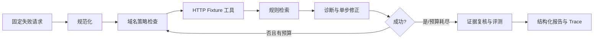

# A-Pidoc / API Doctor

API Doctor 是一个面向初级开发者与 SaaS 实施人员的 API 联调诊断 Agent。它把失败请求、接口规范和运行证据组织成一条可复现链路，并在安全策略约束下执行修正、重试与结果复核。

当前版本坚持 **deterministic first**：使用固定案例和确定性 Reasoner 跑通 Agent Harness，以便把工作流问题与外部服务的不确定性分开定位。

## 已完成的最小闭环



覆盖 6 个固定案例：401 鉴权格式、415 Content-Type、422 字段类型、405 请求方法、429 受控重试，以及健康请求。另有域名越权阻断测试。

## 运行

要求 Node.js 20+。

```bash
npm install
npm test
npm run demo
```

启动本地服务：

```bash
npm run serve
curl -X POST http://localhost:3000/api/debug -H "Content-Type: application/json" -d '{"caseId":"auth-header"}'
```

Windows PowerShell 可使用：

```powershell
Invoke-RestMethod -Method Post -Uri http://localhost:3000/api/debug -ContentType application/json -Body '{"caseId":"auth-header"}'
```

V1 开发分支已提供实验性的 curl 解析器和真实 HTTP 工具。真实请求必须显式传入 host allowlist；工具默认只允许 `localhost` 与 `127.0.0.1`，同时限制超时、响应体大小、重定向并脱敏响应中的凭据字段。它们尚未接入稳定版 CLI/API：

```ts
import { parseCurl } from "./dist/src/input/curl-parser.js";
import { RealHttpTool } from "./dist/src/tools/real-http-tool.js";

const request = parseCurl(`curl http://127.0.0.1:3000/health`);
const tool = new RealHttpTool({ allowedHosts: ["127.0.0.1"], timeoutMs: 2_000 });
```

## 开发与发布

需求通过 Issue 发起，改动通过关联 PR 合并；PR 中填写 `Closes #<issue>` 后，合并会自动关闭需求。CI 在 PR 和 `main` 上执行 TypeScript 构建、单元测试与当前确定性 Tier A 评测。

提交信息采用 Conventional Commits。Release Please 会根据 `feat:`、`fix:` 和 `BREAKING CHANGE:` 创建 Release PR；合并该 PR 后自动生成版本 tag、CHANGELOG 和 GitHub Release。完整约定见 [CONTRIBUTING.md](CONTRIBUTING.md)。

## 项目结构

```text
src/
  agent/             确定性诊断器、独立证据 Reviewer
  core/              Agent 编排主循环
  domain/            稳定 JSON/TypeScript 契约
  fixtures/          可重复的故障案例
  input/             curl 等真实输入解析器
  knowledge/         MVP 规则检索
  observability/     全链路 Trace
  security/          请求白名单和尝试预算
  tools/             Fixture 与受限真实 HTTP 工具
  cli.ts             固定数据演示入口
  server.ts          HTTP API 服务入口
test/                核心链路、权限和 Trace 测试
```

## 支持范围

- 稳定能力：确定性 Reasoner、Fixture HTTP 工具、规则检索、安全策略、重试、Reviewer、Trace、离线评测与 HTTP 服务。
- 实验能力：curl 解析与受限真实 HTTP 工具，尚未接入稳定版 CLI/API。
