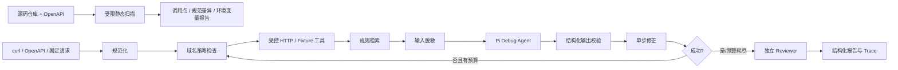

# A-Pidoc / API Doctor

API Doctor 是一个面向初级开发者与 SaaS（Software as a Service，软件即服务）实施人员的 HTTP API（Hypertext Transfer Protocol Application Programming Interface，基于超文本传输协议的应用程序编程接口）联调诊断 Agent（智能体）。它把失败请求、接口规范和运行证据组织成一条可复现链路，并在安全策略约束下执行修正、重试与结果复核。

产品 V2 包含两条互补链路：Repository Preflight（仓库预检）先静态扫描源码中的 API 调用和环境变量，并与 OpenAPI 规范比对；单请求 Debug Agent 再使用 **Pi Agent + deterministic safety baseline（确定性安全基线）** 生成受约束修复计划、执行、重试并复核证据。仓库预检默认不执行网络、不调用模型。

## 已完成的最小闭环



覆盖 6 个固定诊断案例和 1 个固定仓库案例。当前共有 49 项自动化测试；Pi Tier A（每个 PR 必须通过的最小 Agent 评测层）会连续运行 3 次。另有接口滥用、网络越权、敏感信息、预算、超时和非法模型输出测试。

## V0 → V2 的真实迭代

| 阶段 | 发布版本 | 只解决一个问题 | 明确未解决 |
| --- | --- | --- | --- |
| V0 | `v0.1.0` | 固定失败请求能否完成执行、诊断、单步修复、重试和复核 | 真实输入、真实 HTTP、Pi |
| V1-A | `v0.2.0`～`v0.3.0` | curl 和 OpenAPI（OpenAPI Specification，开放接口规范）能否进入受控真实 HTTP 闭环 | Pi 模型路径 |
| V1-B | `v0.4.0` | Pi 能否通过同一 Reasoner 接口生成受约束计划，并保留确定性安全与复核 | 公网模型评测、Skill 动态加载、仓库级诊断 |
| V1-B 安全补丁 | `v0.4.1` | 模型与 HTTP 边界能否阻断凭据泄漏、滥用和无上限调用 | 云端账户预算、Key 轮换、隐私同意 |
| V2 | `v0.5.0` | 能否从本地仓库定位字面量 fetch、规范差异和环境变量缺口 | 动态 URL、Axios、跨文件数据流、自动执行 |

完整证据和每阶段的“改了什么、为什么、怎么证明、尚未解决”见 [构建日志](docs/build-log.md)。

## 运行

要求 Node.js 20.6+（真实模型脚本使用 Node 内置的 `--env-file`）。

```bash
npm ci
npm run check
npm run demo
npm run eval:tier-a
```

预期结果：49 项测试全部通过，6 个固定诊断案例全部显示 `passed: true`，Pi Tier A 显示 `3/3 runs passed`。

运行 V2 固定仓库预检：

```bash
npm run build
node dist/src/cli.js repo --root test/fixtures/repository --document test/fixtures/repository/openapi.json
```

该 fixture 故意包含一个 OpenAPI 未声明调用和两个未声明环境变量，因此命令返回退出码 1，并输出带文件与行号的 JSON 报告。这是预期的“发现问题”，不是扫描器崩溃。

启动本地服务：

```bash
npm run serve
curl -X POST http://localhost:3000/api/debug -H "Content-Type: application/json" -d '{"caseId":"auth-header"}'
```

Windows PowerShell 可使用：

```powershell
Invoke-RestMethod -Method Post -Uri http://localhost:3000/api/debug -ContentType application/json -Body '{"caseId":"auth-header"}'
```

## Pi Agent 模式

默认模式是 `deterministic`，因此本地开发和 CI（Continuous Integration，持续集成）不需要外部密钥。启用真实 Pi Agent 时，CLI（Command-Line Interface，命令行界面）和 HTTP API 读取同一组服务端环境变量：

| 变量 | 必需 | 含义 |
| --- | --- | --- |
| `A_PIDOC_REASONER=pi` | 是 | 显式启用 Pi，避免静默伪装成模型路径 |
| `A_PIDOC_PI_PROVIDER` | 否 | Pi provider，默认 `deepseek`；需要时可显式覆盖 |
| `A_PIDOC_PI_MODEL` | 否 | 模型 ID，默认 `deepseek-v4-pro`（DeepSeek V4 Pro）；需要时可显式覆盖 |
| `A_PIDOC_PI_API_KEY` | 二选一 | 通用密钥入口；DeepSeek 也可使用标准环境变量 `DEEPSEEK_API_KEY` |
| `A_PIDOC_PI_FALLBACK` | 否 | `none`（默认）或 `deterministic`；只有显式配置才降级 |
| `A_PIDOC_PI_TIMEOUT_MS` | 否 | 单次模型诊断超时，默认 30000，允许 100–300000 |
| `A_PIDOC_PI_MAX_OUTPUT_TOKENS` | 否 | 单次模型最大输出 Token，默认 2048，允许 256–4096 |
| `A_PIDOC_PI_MAX_PROMPT_BYTES` | 否 | 脱敏后 Prompt 大小上限，默认 32768 字节 |
| `A_PIDOC_API_TOKEN` | 本机可选 | `/api/debug` 的 Bearer Token；监听非 loopback 地址时必须配置，至少 16 字符 |
| `A_PIDOC_ALLOWED_PORTS` | 否 | 服务端目标端口白名单，默认 `80,443` |

PowerShell 示例：

```powershell
$env:A_PIDOC_REASONER = "pi"
$env:DEEPSEEK_API_KEY = "<your-api-key>" # 请手动填写，不要提交到仓库
$env:A_PIDOC_PI_FALLBACK = "deterministic"
npm run serve
```

若要让后续本地测试稳定复用 DeepSeek 配置，请复制项目模板并只在被 Git 忽略的 `.env` 中填写真实密钥：

```powershell
Copy-Item .env.example .env
# 用编辑器打开 .env，将 replace-with-your-deepseek-api-key 替换为真实密钥
npm run test:pi:live # 单次真实模型冒烟测试，明确禁用 deterministic fallback
npm run serve:pi    # 加载同一份 .env 启动本地服务
```

普通的 `npm test`、`npm run check` 和 CI 不加载 `.env`，也不会产生公网模型费用。`$env:NAME = "value"` 只对当前 PowerShell 及其子进程生效；不同终端和已经运行的 Codex 进程看不到该变量。

Pi 模式默认使用 DeepSeek V4 Pro；`A_PIDOC_PI_PROVIDER` 和 `A_PIDOC_PI_MODEL` 仅用于有意覆盖默认模型。密钥只由 Pi provider 获取，不写入 Prompt、Trace 或报告。进入模型的请求、响应和规范会先做字段级与自由文本脱敏；provider 原始错误不会返回客户端。模型输出还必须通过 root cause、action、字段类型和敏感操作校验。每个任务最多进行两次模型诊断，provider 自动重试关闭，并记录 Pi 返回的 Token usage 与 SDK 估算费用。SDK 价格元数据可能滞后，不能替代 DeepSeek 账户预算和账单告警。

离线测试并非模拟 `PiReasoner` 接口：它会真实实例化官方 Pi `Agent`，使用 Pi 的 faux provider 产生可控响应，再跑过 Orchestrator、HTTP Tool、Reviewer 和 Trace。`npm run eval:tier-a` 会额外连续运行三次 Pi Tier A 集合。

## V1 真实输入

V1 支持 curl 与 OpenAPI 3.x operation（接口操作定义）。真实请求必须配置 Host Allowlist（主机白名单）和 Port Allowlist（端口白名单）；CLI 通过 `--allow-host`、`--allow-port` 显式传入，HTTP 服务通过 `A_PIDOC_ALLOWED_HOSTS`、`A_PIDOC_ALLOWED_PORTS` 配置，客户端请求不能扩大服务端权限。工具还检查 DNS 解析后的私网地址、限制超时、请求/响应大小与重定向，并脱敏报告中的凭据和基础个人信息。

`/api/debug` 默认拒绝所有带 `Origin` 的浏览器请求，并对每个来源地址执行每分钟 30 次限流和最多 2 个并发任务。设置 `A_PIDOC_API_TOKEN` 后，调用方必须发送 `Authorization: Bearer <token>`。`/health` 不触发模型。生产环境仍需配置 Secret Manager、Key 轮换、账户级余额/账单告警和隐私告知。

请求体和报告使用 JSON（JavaScript Object Notation，JavaScript 对象表示法）；当前 OpenAPI 校验只覆盖项目实现的 JSON Schema（JSON 结构规范）子集。

完整本地示例见 [examples/README.md](examples/README.md)。快速运行 curl 诊断：

```bash
node examples/mock-api.mjs
node dist/src/cli.js curl --input examples/order.curl --spec examples/order-spec.json --allow-host 127.0.0.1 --allow-port 3001
```

HTTP API 同时保留 V0 `{ "caseId": "auth-header" }` 输入，并新增：

```json
{
  "kind": "curl",
  "command": "curl -X POST http://127.0.0.1:3001/orders -H 'Content-Type: text/plain' -d '{\"amount\":12}'",
  "spec": {
    "method": "POST",
    "requiredHeaders": { "Content-Type": "application/json" },
    "requiredBody": { "amount": "number" }
  }
}
```

## 文档导航

- [架构与核心链路](docs/architecture.md)：数据流、模块边界、关键取舍和当前风险。
- [V0 → V2 构建日志](docs/build-log.md)：按真实提交、Issue、PR 和测试记录迭代。
- [面试追问题](docs/interview.md)：根据真实实现生成问题，回答由你自己填写。
- [贡献与发布工作流](CONTRIBUTING.md)：Issue、分支、CI/CD（Continuous Integration / Continuous Delivery，持续集成与持续交付）和 Release 规则。

个人求职分析、JD、废弃方案和未来规划保存在本地 `.private/planning-docs/`，由 `.gitignore` 排除，不进入 GitHub。

## 开发与发布

需求通过 Issue 发起，改动通过关联 PR 合并；PR 中填写 `Closes #<issue>` 后，合并会自动关闭需求。CI 在 PR 和 `main` 上执行 TypeScript 构建、单元测试、确定性基线与三轮离线 Pi Tier A 稳定性评测。

提交信息采用 Conventional Commits。Release Please 会根据 `feat:`、`fix:` 和 `BREAKING CHANGE:` 创建 Release PR；合并该 PR 后自动生成版本 tag、CHANGELOG 和 GitHub Release。完整约定见 [CONTRIBUTING.md](CONTRIBUTING.md)。

## 项目结构

```text
src/
  agent/             Pi/确定性诊断器、版本化 Prompt、独立证据 Reviewer
  config/            Pi provider/model/fallback 运行配置
  core/              Agent 编排主循环
  domain/            稳定 JSON/TypeScript 契约
  fixtures/          可重复的故障案例
  input/             curl 等真实输入解析器
  knowledge/         MVP 规则检索
  observability/     全链路 Trace
  repository/        V2 仓库扫描、OpenAPI 比对和结构化报告
  security/          脱敏、公开错误、请求白名单和预算
  tools/             Fixture 与受限真实 HTTP 工具
  cli.ts             固定数据演示入口
  server.ts          HTTP API 服务入口
scripts/             Pi Tier A 多轮稳定性评测
test/                核心链路、Pi 输出校验、权限和 Trace 测试
examples/            本地 Mock API 与 V1 可复现输入
.pi/skills/          领域工作流说明；当前 PiReasoner 尚未动态加载
docs/                可由仓库事实验证的公开文档
.private/            本地个人资料和规划，不进入 Git
```

## 支持范围

- 稳定能力：确定性 Reasoner、Fixture 回归集、规则检索、安全策略、重试、Reviewer、Trace 与离线评测。
- V1 能力：官方 Pi Agent 运行时、版本化 Debug Prompt、受约束的模型修复计划、显式降级、curl/OpenAPI、JSON Schema 基线校验、受限真实 HTTP、CLI/HTTP API、调用预算和全链路脱敏。
- V2 能力：受限扫描 JavaScript/TypeScript，定位字面量 `fetch`、方法、源码行号、OpenAPI operation 匹配和 `.env.example` 声明缺口；扫描默认无网络和模型调用。
- 暂不支持：OpenAPI `$ref`、非 JSON request body、动态 URL/跨文件数据流、Axios/自定义客户端、文档 RAG（Retrieval-Augmented Generation，检索增强生成）/rerank、Skill 动态加载、Pi 工具自主调用、自动执行扫描请求、生产部署和公网模型在线 CI。
