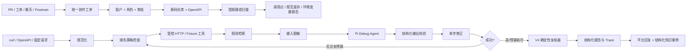

# A-Pidoc / API Doctor

当前完整秋招V5已发布 `v0.18.0`，包含持续可靠性闭环与可复跑的探针性能优化；版本/tag/Release/CI一致性见 [性能补充发布审计](docs/v5-performance-release-audit.md)。基础V5 `v0.17.0` 的 [历史审计](docs/v5-release-audit.md)、V4.5 `v0.16.0` 与 [治理审计](docs/v45-release-audit.md)保留。长期SLO与生产部署不属本轮验收条件，模型控制面见 [Harness文档](docs/agentic-harness.md)。

API Doctor 是一个面向初级开发者与 SaaS（Software as a Service，软件即服务）实施人员的 HTTP API（Hypertext Transfer Protocol Application Programming Interface，基于超文本传输协议的应用程序编程接口）联调诊断 Agent（智能体）。它把失败请求、接口规范和运行证据组织成一条可复现链路，并在安全策略约束下执行修正、重试与结果复核。

V4 历史版本把 V0～V3 的单请求、仓库与契约能力接入受控团队工作流：平台载荷归一化、租户/角色/日志/结构化案例、结果发布与知识批准、脱敏 Postman。V4.5 的复杂任务入口改为 Pi 自主选工具，由 Guardrail、持久事实状态、Evidence Gate 和独立模型 Reviewer 治理；实际工具覆盖 runtime-api 与 repository-contract，发布前 offline/live 证据分别保存。平台连接器仍是受控验证，没有真实企业账号采纳证据。

## V4 历史闭环（保留兼容）



保留 6 个入门 Fixture、3 个固定仓库样例和 26 个本地真实 HTTP 业务评测案例。V2 覆盖 Fetch、Axios、Requests、OkHttp 四类受限语法、JS/TS 同文件及具名导入常量、环境变量引用、任务/测试/补丁计划和隔离验证。业务评测包含主动停止的案例，不以所有请求都成功作为目标。

## V0 → V4 的真实迭代

| 阶段 | 发布版本 | 只解决一个问题 | 明确未解决 |
| --- | --- | --- | --- |
| V0 | `v0.1.0` | 固定失败请求能否完成执行、诊断、单步修复、重试和复核 | 真实输入、真实 HTTP、Pi |
| V1-A | `v0.2.0`～`v0.3.0` | curl 和 OpenAPI（OpenAPI Specification，开放接口规范）能否进入受控真实 HTTP 闭环 | Pi 模型路径 |
| V1-B | `v0.4.0` | Pi 能否通过同一 Reasoner 接口生成受约束计划，并保留确定性安全与复核 | 公网模型评测、Skill 动态加载、仓库级诊断 |
| V1-B 安全补丁 | `v0.4.1` | 模型与 HTTP 边界能否阻断凭据泄漏、滥用和无上限调用 | 云端账户预算、Key 轮换、隐私同意 |
| V2 | `v0.8.0`～`v0.9.0` | 能否从本地仓库定位四类客户端调用、追踪有限配置来源，并在隔离副本应用补丁和运行契约测试 | 任意 AST、完整跨文件数据流、原仓库自动写回、未知目标执行 |
| V3 | `v0.10.0` | 能否比较 OpenAPI 版本、定位真实受影响调用，并验证一类无损迁移 | 全量 OpenAPI/JSON Schema、字段重命名推断、历史持久化、PR 集成 |
| V4 | `v0.11.0` | 能否把工单、日志、诊断、平台回复和结构化知识连成受权限约束的团队闭环 | 真实企业账号、异步队列、生产部署、向量知识库、管理 UI |
| V1 文档补齐 | Issue #24 | Swagger 2、本地引用、Markdown/HTML 规范块、递归 Schema 校验 | 任意自然语言文档推断、完整 JSON Schema、非 JSON body |
| V1 故障评测补齐 | Issue #26 | 26 个本地 HTTP 案例、14 类明确故障及 UNKNOWN、安全转换、请求变化复核 | 真实用户效果、任意语义修复、完整 V2 |

V4.5 在 V4 后补齐自主工具循环、领域护栏、审批恢复、收敛工作区、硬证据门禁、两个实际工具族和独立 Reviewer；完整版本不以 PR-1～PR-4 的基础治理替代。完整证据和每阶段的“改了什么、为什么、怎么证明、尚未解决”见 [构建日志](docs/build-log.md)。

## 运行

要求 Node.js 22.19+（Pi 0.85.1 的运行要求；真实模型脚本使用 Node 内置的 `--env-file`）。

```bash
npm ci
npm run check
npm run demo
npm run eval:tier-a
```

预期结果以命令实际输出为准；6 个入门案例全部显示 `passed: true`，Pi Tier A 显示 `3/3 runs passed`。

上面是最短入门路径，不等于完整质量门禁。与required CI对齐的本地命令、各版本冻结指标和故障排查见 [V0 → V5验证指南](docs/verification.md)。

运行冻结业务集：`npm run eval:business`。它启动临时 loopback HTTP 服务，运行 26 个案例并输出 JSON 指标；不需要 Key，不调用公网模型。`passed` 检查根因、预期状态、尝试数和证据，`resolvedRate` 单独统计请求恢复比例。403、过期凭据、长时间限流和写请求超时应停止，不能算作自动修复成功。时延是当前机器的合成评测耗时，不能代表生产 p95；模型费用 0 是因为此评测使用确定性 Reasoner。

运行 V2 固定仓库预检与计划生成：

```bash
npm run build
node dist/src/cli.js repo --root test/fixtures/repository --document test/fixtures/repository/openapi.json
node dist/src/cli.js repo-plan --root test/fixtures/repository-v2 --document test/fixtures/repository-v2/openapi.json
npm run eval:repository
```

该 fixture 故意包含一个 OpenAPI 未声明调用和两个未声明环境变量，因此命令返回退出码 1，并输出带文件与行号的 JSON 报告。这是预期的“发现问题”，不是扫描器崩溃。

隔离验证要求新目录和显式批准；它复制 fixture、应用建议、重新扫描并执行生成的无网络契约测试，不修改原仓库：

```bash
node dist/src/cli.js repo-verify --root test/fixtures/repository-v2-repair --document test/fixtures/repository-v2-repair/openapi.json --workspace ../a-pidoc-v2-workspace --approved true
```

`repo-verify` 只应用确定性且可唯一定位的 URL 替换与 `.env.example` 追加；复杂表达式继续输出 Finding。输出目录必须不存在且位于源仓库之外，防止覆盖用户工作区。

运行 V3 契约 Diff、影响分析与冻结评测：

```bash
node dist/src/cli.js contract-diff --previous test/fixtures/repository-v3-impact/old.json --next test/fixtures/repository-v3-impact/new.json
node dist/src/cli.js contract-impact --root test/fixtures/repository-v3-impact --previous test/fixtures/repository-v3-impact/old.json --next test/fixtures/repository-v3-impact/new.json
node dist/src/cli.js contract-verify --root test/fixtures/repository-v3-migration --previous test/fixtures/repository-v3-migration/old.json --next test/fixtures/repository-v3-migration/new.json --workspace ../a-pidoc-v3-workspace --approved true
npm run eval:contract
```

前两个命令发现 breaking change 或受影响调用时返回退出码 1，这是供 CI 使用的风险门禁，不是程序崩溃。`contract-verify` 的 `--workspace` 必须是源仓库之外且尚不存在的新目录；它只处理可证明无损的字符串/数字/布尔字面量转换，未知值不猜测。重复运行示例时请换一个新的 workspace 路径。

## V4 团队协作与知识积累

运行不联网的完整团队工作流演示：

```bash
npm run demo:team
npm run eval:collaboration
npm run build && node dist/src/cli.js collaboration-demo
```

V4 冻结竖切从 Jira 工单开始，先查关联日志和同租户结构化案例，再复用 V1 的诊断/复核链，最后在显式批准后生成 Jira 回复载荷、带状态断言的脱敏 Postman 回归 Collection，并把成功案例写入临时 JSON 知识库。评测同时验证五类平台载荷、Postman 往返、凭据脱敏和六阶段 Trace。

单独检查 Jira webhook 或 Postman：

```bash
npm run build
node dist/src/cli.js collaboration-normalize --platform jira --input examples/collaboration/jira-issue.json --tenant team-a
node dist/src/cli.js postman-import --input examples/collaboration/postman-collection.json
node dist/src/cli.js postman-export --input examples/collaboration/requests.json
```

GitHub/GitLab、Jira、Slack 和飞书适配器只解析文档化载荷并构造回复请求；冻结评测使用内存平台 Connector，不持有或调用真实平台 Token。知识库只保存错误特征、operation、根因、有效修复、验证方式、适用版本和证据来源，不保存完整对话。当前没有异步任务队列、生产 Webhook 服务、真实平台写回或管理界面。

启动本地服务：

```bash
npm run serve
curl -X POST http://localhost:3000/api/debug -H "Content-Type: application/json" -d '{"caseId":"auth-header"}'
```

Windows PowerShell 可使用：

```powershell
Invoke-RestMethod -Method Post -Uri http://localhost:3000/api/debug -ContentType application/json -Body '{"caseId":"auth-header"}'
```

## Pi Agent 模式

默认模式是 `deterministic`，因此本地开发和 CI（Continuous Integration，持续集成）不需要外部密钥。启用真实 Pi Agent 时，CLI（Command-Line Interface，命令行界面）和 HTTP API 读取同一组服务端环境变量：

| 变量 | 必需 | 含义 |
| --- | --- | --- |
| `A_PIDOC_REASONER=pi` | 是 | 显式启用 Pi，避免静默伪装成模型路径 |
| `A_PIDOC_PI_PROVIDER` | 否 | Pi provider，默认 `deepseek`；需要时可显式覆盖 |
| `A_PIDOC_PI_MODEL` | 否 | 模型 ID，默认 `deepseek-v4-pro`（DeepSeek V4 Pro）；需要时可显式覆盖 |
| `A_PIDOC_PI_API_KEY` | 二选一 | 通用密钥入口；DeepSeek 也可使用标准环境变量 `DEEPSEEK_API_KEY` |
| `A_PIDOC_PI_FALLBACK` | 否 | `none`（默认）或 `deterministic`；只有显式配置才降级 |
| `A_PIDOC_PI_TIMEOUT_MS` | 否 | 单次模型诊断超时，默认 30000，允许 100–300000 |
| `A_PIDOC_PI_MAX_OUTPUT_TOKENS` | 否 | 单次模型最大输出 Token，默认 2048，允许 256–4096 |
| `A_PIDOC_PI_MAX_PROMPT_BYTES` | 否 | 脱敏后 Prompt 大小上限，默认 32768 字节 |
| `A_PIDOC_API_TOKEN` | 本机可选 | `/api/debug` 的 Bearer Token；监听非 loopback 地址时必须配置，至少 16 字符 |
| `A_PIDOC_ALLOWED_PORTS` | 否 | 服务端目标端口白名单，默认 `80,443` |

PowerShell 示例：

```powershell
$env:A_PIDOC_REASONER = "pi"
$env:DEEPSEEK_API_KEY = "<your-api-key>" # 请手动填写，不要提交到仓库
$env:A_PIDOC_PI_FALLBACK = "deterministic"
npm run serve
```

若要让后续本地测试稳定复用 DeepSeek 配置，请复制项目模板并只在被 Git 忽略的 `.env` 中填写真实密钥：

```powershell
Copy-Item .env.example .env
# 用编辑器打开 .env，将 replace-with-your-deepseek-api-key 替换为真实密钥
npm run test:pi:live # 单次真实模型冒烟测试，明确禁用 deterministic fallback
npm run serve:pi    # 加载同一份 .env 启动本地服务
```

普通的 `npm test`、`npm run check` 和 CI 不加载 `.env`，也不会产生公网模型费用。`$env:NAME = "value"` 只对当前 PowerShell 及其子进程生效；不同终端和已经运行的 Codex 进程看不到该变量。

Pi 模式默认使用 DeepSeek V4 Pro；`A_PIDOC_PI_PROVIDER` 和 `A_PIDOC_PI_MODEL` 仅用于有意覆盖默认模型。密钥只由 Pi provider 获取，不写入 Prompt、Trace 或报告。进入模型的请求、响应和规范会先做字段级与自由文本脱敏；provider 原始错误不会返回客户端。模型输出还必须通过 root cause、action、字段类型和敏感操作校验。旧 PiReasoner 路径每个任务最多进行两次模型诊断；新 agent-run 路径采用任务级模型/工具/Token/费用/时长与 Reviewer 共用预算。provider 自动重试关闭，并记录 Pi 返回的 Token usage 与 SDK 估算费用。SDK 价格元数据可能滞后，不能替代 DeepSeek 账户预算和账单告警。

离线测试并非模拟 `PiReasoner` 接口：它会真实实例化官方 Pi `Agent`，使用 Pi 的 faux provider 产生可控响应，再跑过 Orchestrator、HTTP Tool、Reviewer 和 Trace。`npm run eval:tier-a` 会额外连续运行三次 Pi Tier A 集合。

## V1 真实输入

V1 支持 curl 与 OpenAPI 3.x operation（接口操作定义）。真实请求必须配置 Host Allowlist（主机白名单）和 Port Allowlist（端口白名单）；CLI 通过 `--allow-host`、`--allow-port` 显式传入，HTTP 服务通过 `A_PIDOC_ALLOWED_HOSTS`、`A_PIDOC_ALLOWED_PORTS` 配置，客户端请求不能扩大服务端权限。工具还检查 DNS 解析后的私网地址、限制超时、请求/响应大小与重定向，并脱敏报告中的凭据和基础个人信息。

`/api/debug` 默认拒绝所有带 `Origin` 的浏览器请求，并对每个来源地址执行每分钟 30 次限流和最多 2 个并发任务。设置 `A_PIDOC_API_TOKEN` 后，调用方必须发送 `Authorization: Bearer <token>`。`/health` 不触发模型。生产环境仍需配置 Secret Manager、Key 轮换、账户级余额/账单告警和隐私告知。

请求体和报告使用 JSON（JavaScript Object Notation，JavaScript 对象表示法）；当前 OpenAPI 校验只覆盖项目实现的 JSON Schema（JSON 结构规范）子集。

完整本地示例见 [examples/README.md](examples/README.md)。快速运行 curl 诊断：

```bash
node examples/mock-api.mjs
node dist/src/cli.js curl --input examples/order.curl --spec examples/order-spec.json --allow-host 127.0.0.1 --allow-port 3001
```

HTTP API 同时保留 V0 `{ "caseId": "auth-header" }` 输入，并新增：

```json
{
  "kind": "curl",
  "command": "curl -X POST http://127.0.0.1:3001/orders -H 'Content-Type: text/plain' -d '{\"amount\":12}'",
  "spec": {
    "method": "POST",
    "requiredHeaders": { "Content-Type": "application/json" },
    "requiredBody": { "amount": "number" }
  }
}
```

## 文档导航

- [架构与核心链路](docs/architecture.md)：数据流、模块边界、关键取舍和当前风险。
- [V0 → V4.5 构建日志](docs/build-log.md)：按真实提交、Issue、PR 和测试记录迭代。
- [V0 → V4.5 验证指南](docs/verification.md)：从干净安装到团队协作闭环的命令、预期信号、退出码和排错入口。
- [V4.5 完整发布审计](docs/v45-release-audit.md)：六批交付、正式版本一致性、offline/live 指标、失败记录与生产边界。
- [V5 持续可靠性](docs/reliability-v5.md)：低成本计划探测、异常聚类、本地工单、持久队列、Harness Worker与中断恢复。
- [贡献与发布工作流](CONTRIBUTING.md)：Issue、分支、CI/CD（Continuous Integration / Continuous Delivery，持续集成与持续交付）和 Release 规则。

个人求职分析、JD、废弃方案和未来规划保存在本地 `.private/planning-docs/`，由 `.gitignore` 排除，不进入 GitHub。

## 开发与发布

需求通过 Issue 发起，改动通过关联 PR 合并；PR 中填写 `Closes #<issue>` 后，合并会自动关闭需求。CI 在 PR 和 `main` 上执行依赖审计、TypeScript 构建、单元测试、三轮离线 Pi Tier A、Repository 修复评测、Contract 迁移评测、Collaboration 团队工作流评测和生成物一致性检查。

提交信息采用 Conventional Commits。Release Please 会根据 `feat:`、`fix:` 和 `BREAKING CHANGE:` 创建 Release PR；合并该 PR 后自动生成版本 tag、CHANGELOG 和 GitHub Release。完整约定见 [CONTRIBUTING.md](CONTRIBUTING.md)。

## 项目结构

```text
src/
  agent/             Pi/确定性诊断器、版本化 Prompt、独立证据 Reviewer
  collaboration/     V4 平台适配、权限、日志、Postman、知识库和团队工作流
  config/            Pi provider/model/fallback 运行配置
  contract/          V3 OpenAPI Diff、影响分析、迁移补丁与隔离验证
  core/              V0～V4 兼容编排主循环
  harness/           Pi 低层适配、工具注册、持久轨迹、审批协议与预算
  api-harness/       API 护栏、事实工作区、投影、硬门禁、工具族与独立 Reviewer
  reliability/       V5 计划探测、异常分流、持久队列、Worker生命周期与本地观测
  domain/            稳定 JSON/TypeScript 契约
  evaluation/        业务、仓库、契约和团队协作冻结评测
  fixtures/          可重复的故障案例
  input/             curl 等真实输入解析器
  knowledge/         MVP 规则检索
  observability/     全链路 Trace
  repository/        V2 仓库扫描、OpenAPI 比对和结构化报告
  security/          脱敏、公开错误、请求白名单和预算
  tools/             Fixture 与受限真实 HTTP 工具
  cli.ts             固定数据演示入口
  server.ts          HTTP API 服务入口
scripts/             Pi、仓库、契约与团队协作评测入口
test/                核心链路、仓库/契约/协作、Pi 输出、权限和 Trace 测试
examples/            本地 Mock API 与 V1 可复现输入
.pi/skills/          领域工作流说明；当前 PiReasoner 尚未动态加载
docs/                可由仓库事实验证的公开文档
.private/            本地个人资料和规划，不进入 Git
```

## 支持范围

文档输入支持 OpenAPI 3.x / Swagger 2.0 JSON，也支持 Markdown 中唯一的 JSON fenced block 或 HTML 的 `<pre><code>` JSON 规范块。CLI 的 `openapi --document` 可直接接收这些文件；HTTP API 的 `document` 可传对象或文档字符串。系统不会执行 HTML，也不会抓取外部引用。示例操作参数仍使用 `--path /orders --method POST`。

请求 Schema 支持本地 `$ref`、嵌套对象/数组、必填项、enum/const、integer、nullable、数值上下界和字符串/数组长度。缺少值时仅使用明确 example/default；未知值保留缺失错误。循环引用、外部引用、组合 Schema、pattern、format 等未支持断言会明确拒绝，不能把未知约束当作校验通过。

- 稳定能力：确定性 Reasoner、Fixture 回归集、规则检索、安全策略、重试、Reviewer、Trace 与离线评测。
- V1 能力：官方 Pi Agent 运行时、版本化 Debug Prompt、受约束的模型修复计划、显式降级、curl/OpenAPI、JSON Schema 基线校验、受限真实 HTTP、CLI/HTTP API、调用预算和全链路脱敏。
- V2 能力：在文档化语法子集内扫描 Fetch、Axios、Python Requests 和 Java OkHttp；定位方法与源码行号，追踪 JS/TS 同文件或具名导入常量及环境引用，并在隔离副本执行唯一可判定的 URL/环境模板补丁和生成测试。扫描默认无网络和模型调用。
- V3 能力：比较 OpenAPI operation 与 JSON request/response 字段的增删、类型和 required 变化；将风险映射到 V2 已解析调用点，并在显式批准的隔离副本验证一类无损字面量迁移。
- V4 能力：归一化 GitHub PR、GitLab MR、Jira Issue、Slack/飞书消息，构造对应回复载荷；导入/导出受限 Postman JSON 请求；以角色、租户和双审批约束日志查询、诊断、发布与结构化知识入库。
- V4.5 能力：复杂任务由 Pi 自主选择注册工具，支持 runtime-api 调查与有限 repository-contract 隔离迁移；持久轨迹、准确批准后的模型重发、事实投影、硬 Gate 与独立 Reviewer 约束执行和完成。简单固定 case 保留零模型路径，发布仅为批准后的本地 fixture 草稿。
- 暂不支持：OpenAPI 外部/循环 `$ref`、非 JSON request body、完整 AST 与函数间/运行时数据流、自定义客户端、字段重命名或业务值推断、响应字段使用级追踪、自动历史副作用回放、真实企业平台账号与网络写回、生产分布式队列、向量知识检索、管理 UI、Skill 动态加载、生产部署和公网模型在线 CI。

复杂 API 调查的新入口是 `agent-run`（Pi 低层循环、实际工具、审批恢复、收敛状态、硬证据门禁与独立 Reviewer）；简单已知 case 保留零模型的确定性路径。使用方式见 [API 工具族](docs/api-tool-bundles.md)，验收与边界见 [Reviewer/配对评测](docs/reviewer-evaluation.md)。`eval:agentic` 为离线 required gate，`eval:agentic:live` 为私有凭据的发布前验收。

V5 持续可靠性入口是 `reliability-*` CLI，或先运行 `npm run demo:reliability`：健康合法/负例探测零模型，复杂异常经持久队列复用上述Harness，高风险本地草稿需准确批准，响应结构持续异常保留人工接管。JSON队列是本地受控实现，生产分布式队列/长期监控/SLO仍未验证；三轮 `eval:reliability` 为离线门禁，`eval:reliability:live` 为独立发布前验收。

## V5 秋招性能证据

独立确定性探针支持显式有界并发，保留默认串行与原Harness审批链路；同场景串行1/并发4、注入40ms与零注入延迟对照、173项单测及独立live验收见 [性能说明](docs/v5-performance.md)。长期SLO与生产部署不属于本轮秋招验收条件。
