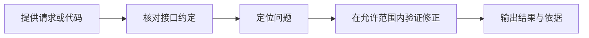

# A-Pidoc · API Doctor

**让接口联调，从反复试错变成有据可查。**

定位失败请求，核对接口约定，验证可行修正。

[](package.json)
[](src/)
[](https://github.com/LarryBUPT/A-Pidoc/actions/workflows/ci.yml)
[](https://github.com/LarryBUPT/A-Pidoc/releases)

[快速开始](#-快速开始) · [使用指南](docs/guides/getting-started.md) · [文档中心](docs/README.md) · [参与贡献](CONTRIBUTING.md)

---

## ✨ 为什么使用 API Doctor

接口请求失败时，问题可能藏在请求头、参数类型、接口文档或代码配置里。API Doctor 面向开发者和软件实施人员，把这些线索放到一起，帮助你找出原因，并检查修正后是否真的有效。

你可以从一条 curl 请求开始，也可以核对本地代码与接口文档，或在接口升级前查看哪些调用可能受到影响。诊断报告保留尝试过程和验证结果，方便复现问题、与同事协作。

## 🧭 可以帮你做什么

| 你的场景 | API Doctor 提供的帮助 |
| --- | --- |
| 请求一直报错，不知道从哪里排查 | 结合请求与接口文档，检查请求头、方法、参数类型等常见问题 |
| 文档看起来没问题，代码却调用失败 | 扫描支持的客户端调用，定位与文档不一致的地方和缺失的环境配置 |
| 接口准备升级，担心影响现有代码 | 比较前后两份接口规范，找出可能受影响的调用 |
| 想验证修正，担心改坏原项目 | 对支持的修正，在独立副本中应用并运行检查 |
| 需要把排查结果交给同事 | 在本地协作演示中生成回复草稿、脱敏 Postman 请求与可复用案例 |
| 想体验接口巡检与异常处理 | 运行本地巡检演示，查看异常记录、调查结果与需要人工接手的情况 |

## 🚀 快速开始

需要 **Node.js 22.19 或更高版本**和 npm。在仓库根目录运行：

```bash
npm ci
npm run demo
```

演示包含请求头、内容类型、参数类型、请求方法、临时限流和正常请求六个案例，**不需要 API Key，也不调用公网模型**。终端会显示每个案例的状态、原因、尝试次数与检查结果；六个案例的 `passed` 均应为 `true`。

选择你想继续体验的方向：

| 想体验什么 | 入口 |
| --- | --- |
| 开箱体验 Agent 工具调用与证据门禁 | `npm run demo:harness` |
| 体验人工审批与隔离迁移验证 | `npm run demo:harness -- --migration` |
| 诊断一条本地 HTTP 请求 | [运行请求示例](examples/README.md) |
| 扫描仓库、检查接口升级影响 | [使用指南](docs/guides/getting-started.md) |
| 团队协作演示 | `npm run demo:team` |
| 接口巡检演示 | `npm run demo:reliability` |
| 接入模型辅助诊断 | [模型配置](docs/guides/model-setup.md) |

Harness 演示免密钥：模型决策和语义复核使用预设演示响应，真实执行本地 HTTP、文件与测试工具，以及审批和证据门禁。默认场景自动启动本地接口并展示 415→200；迁移场景在修改和运行测试前分别询问是否批准，输入 `yes` 才执行，默认拒绝。每次运行自动建立独立记录目录，摘要和完整证据保存在 `.private/runs/`。它用于体验运行机制，不代表真实模型自主调查能力。详见[使用指南](docs/guides/getting-started.md#体验-harness-交互免密钥)。

## 🔎 一次排查如何进行



简单的已知问题可通过内置规则处理；复杂调查可以使用 Pi 驱动的模型辅助诊断。报告会区分已验证的结果与尚未解决的问题，需要授权的操作会等待批准。无法确认修正是否安全时，任务会停止或保留人工接手入口。

## 🛡️ 使用前了解

API Doctor 当前是一个以命令行和本地 HTTP 服务为入口的实验性项目，适合学习、接口联调和受控环境中的验证。

- **请求目标需要明确允许。** 真实 HTTP 诊断要指定允许访问的主机与端口；报告会对常见凭据和敏感字段进行脱敏。
- **代码检查有范围。** 支持 Fetch、Axios、Python Requests 和 Java OkHttp 的部分常见写法；接口规范支持 OpenAPI 3.x / Swagger 2.0 的部分 JSON 能力。
- **自动修正有边界。** 只验证可明确判断的修正；仓库修正在独立副本中进行，复杂业务逻辑仍需人工判断。
- **协作功能以本地演示为主。** 可处理支持的平台输入并构造回复草稿，目前未接入真实企业账号或平台发送。
- **巡检已在本地受控场景验证。** 这些结果不代表生产环境长期可用性，也不保证任意接口都能自动恢复。

## 📚 文档与项目导航

| 你想了解 | 从这里开始 |
| --- | --- |
| 怎么运行、怎么看结果 | [使用指南](docs/guides/getting-started.md) |
| 怎么配置模型 | [模型配置](docs/guides/model-setup.md) |
| 如何找到其他资料 | [文档中心](docs/README.md) |
| 如何验证项目 | [验证指南](docs/verification.md) |
| 如何参与开发 | [贡献指南](CONTRIBUTING.md) |

## 📁 仓库目录

```text
A-Pidoc/
├── README.md          项目首页
├── docs/              文档中心
│   ├── README.md      分类导航
│   ├── guides/        使用与配置指南
│   └── evidence/      公开验证记录
├── examples/          可运行的本地示例
├── src/               项目源码
├── test/              自动检查与测试样例
├── scripts/           演示与评测脚本
└── .github/           贡献模板与自动检查
```

## 🤝 反馈与贡献

欢迎通过 [Issues](https://github.com/LarryBUPT/A-Pidoc/issues)反馈可复现的问题或提出使用建议。参与开发前请阅读[贡献指南](CONTRIBUTING.md)。
