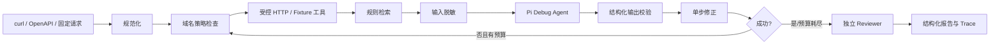

# A-Pidoc / API Doctor

API Doctor 是一个面向初级开发者与 SaaS 实施人员的 API 联调诊断 Agent。它把失败请求、接口规范和运行证据组织成一条可复现链路，并在安全策略约束下执行修正、重试与结果复核。

产品 V1 使用 **Pi Agent + deterministic safety baseline**：Pi Debug Agent 负责基于请求、响应、规范和规则生成结构化修复计划；本地 schema gate、安全策略、HTTP Tool 和独立 Reviewer 决定计划能否执行及证据是否成立。确定性 Reasoner 同时保留为离线基线和显式降级选项。

## 已完成的最小闭环



覆盖 6 个固定案例：401 鉴权格式、415 Content-Type、422 字段类型、405 请求方法、429 受控重试，以及健康请求。另有域名越权阻断测试。

## 运行

要求 Node.js 20+。

```bash
npm install
npm test
npm run demo
npm run eval:tier-a
```

启动本地服务：

```bash
npm run serve
curl -X POST http://localhost:3000/api/debug -H "Content-Type: application/json" -d '{"caseId":"auth-header"}'
```

Windows PowerShell 可使用：

```powershell
Invoke-RestMethod -Method Post -Uri http://localhost:3000/api/debug -ContentType application/json -Body '{"caseId":"auth-header"}'
```

## Pi Agent 模式

默认模式是 `deterministic`，因此本地开发和 CI 不需要外部密钥。启用真实 Pi Agent 时，CLI 和 HTTP API 读取同一组服务端环境变量：

| 变量 | 必需 | 含义 |
| --- | --- | --- |
| `A_PIDOC_REASONER=pi` | 是 | 显式启用 Pi，避免静默伪装成模型路径 |
| `A_PIDOC_PI_PROVIDER` | 是 | Pi provider，例如智谱使用 `zai` |
| `A_PIDOC_PI_MODEL` | 是 | 锁定模型 ID，例如 `glm-4.7` |
| `A_PIDOC_PI_API_KEY` | 二选一 | 通用密钥入口；也可使用 Pi 支持的 provider 标准环境变量，如 `ZAI_API_KEY` |
| `A_PIDOC_PI_FALLBACK` | 否 | `none`（默认）或 `deterministic`；只有显式配置才降级 |
| `A_PIDOC_PI_TIMEOUT_MS` | 否 | 单次模型诊断超时，默认 30000，允许 100–300000 |

PowerShell 示例：

```powershell
$env:A_PIDOC_REASONER = "pi"
$env:A_PIDOC_PI_PROVIDER = "zai"
$env:A_PIDOC_PI_MODEL = "glm-4.7"
$env:ZAI_API_KEY = "<your-api-key>"
$env:A_PIDOC_PI_FALLBACK = "deterministic"
npm run serve
```

密钥只由 Pi provider 获取，不写入 Prompt、Trace 或报告。进入模型的请求、响应和规范会先脱敏；模型输出还必须通过 root cause、action、字段类型和敏感操作校验。缺少 provider、model 或 credential 时，Pi 模式会在启动阶段明确失败。

离线测试并非模拟 `PiReasoner` 接口：它会真实实例化官方 Pi `Agent`，使用 Pi 的 faux provider 产生可控响应，再跑过 Orchestrator、HTTP Tool、Reviewer 和 Trace。`npm run eval:tier-a` 会额外连续运行三次 Pi Tier A 集合。

## V1 真实输入

V1 支持 curl 与 OpenAPI 3.x operation。真实请求必须配置 host allowlist；CLI 通过 `--allow-host` 显式传入，HTTP 服务通过 `A_PIDOC_ALLOWED_HOSTS` 环境变量配置，客户端请求不能扩大服务端权限。工具同时限制超时、请求/响应大小和重定向，并脱敏报告中的凭据字段。

完整本地示例见 [examples/README.md](examples/README.md)。快速运行 curl 诊断：

```bash
node examples/mock-api.mjs
node dist/src/cli.js curl --input examples/order.curl --spec examples/order-spec.json --allow-host 127.0.0.1
```

HTTP API 同时保留 V0 `{ "caseId": "auth-header" }` 输入，并新增：

```json
{
  "kind": "curl",
  "command": "curl -X POST http://127.0.0.1:3001/orders -H 'Content-Type: text/plain' -d '{\"amount\":12}'",
  "spec": {
    "method": "POST",
    "requiredHeaders": { "Content-Type": "application/json" },
    "requiredBody": { "amount": "number" }
  }
}
```

## 开发与发布

需求通过 Issue 发起，改动通过关联 PR 合并；PR 中填写 `Closes #<issue>` 后，合并会自动关闭需求。CI 在 PR 和 `main` 上执行 TypeScript 构建、单元测试、确定性基线与三轮离线 Pi Tier A 稳定性评测。

提交信息采用 Conventional Commits。Release Please 会根据 `feat:`、`fix:` 和 `BREAKING CHANGE:` 创建 Release PR；合并该 PR 后自动生成版本 tag、CHANGELOG 和 GitHub Release。完整约定见 [CONTRIBUTING.md](CONTRIBUTING.md)。

## 项目结构

```text
src/
  agent/             Pi/确定性诊断器、版本化 Prompt、独立证据 Reviewer
  config/            Pi provider/model/fallback 运行配置
  core/              Agent 编排主循环
  domain/            稳定 JSON/TypeScript 契约
  fixtures/          可重复的故障案例
  input/             curl 等真实输入解析器
  knowledge/         MVP 规则检索
  observability/     全链路 Trace
  security/          请求白名单和尝试预算
  tools/             Fixture 与受限真实 HTTP 工具
  cli.ts             固定数据演示入口
  server.ts          HTTP API 服务入口
scripts/             Pi Tier A 多轮稳定性评测
test/                核心链路、Pi 输出校验、权限和 Trace 测试
examples/            本地 Mock API 与 V1 可复现输入
```

## 支持范围

- 稳定能力：确定性 Reasoner、Fixture 回归集、规则检索、安全策略、重试、Reviewer、Trace 与离线评测。
- V1 能力：官方 Pi Agent 运行时、版本化 Debug Prompt、受约束的模型修复计划、显式降级、curl/OpenAPI、JSON Schema 基线校验、受限真实 HTTP、CLI/HTTP API 和全链路脱敏。
- 暂不支持：OpenAPI `$ref`、非 JSON request body、文档 RAG/rerank、代码仓库扫描、生产部署和公网模型在线 CI。
