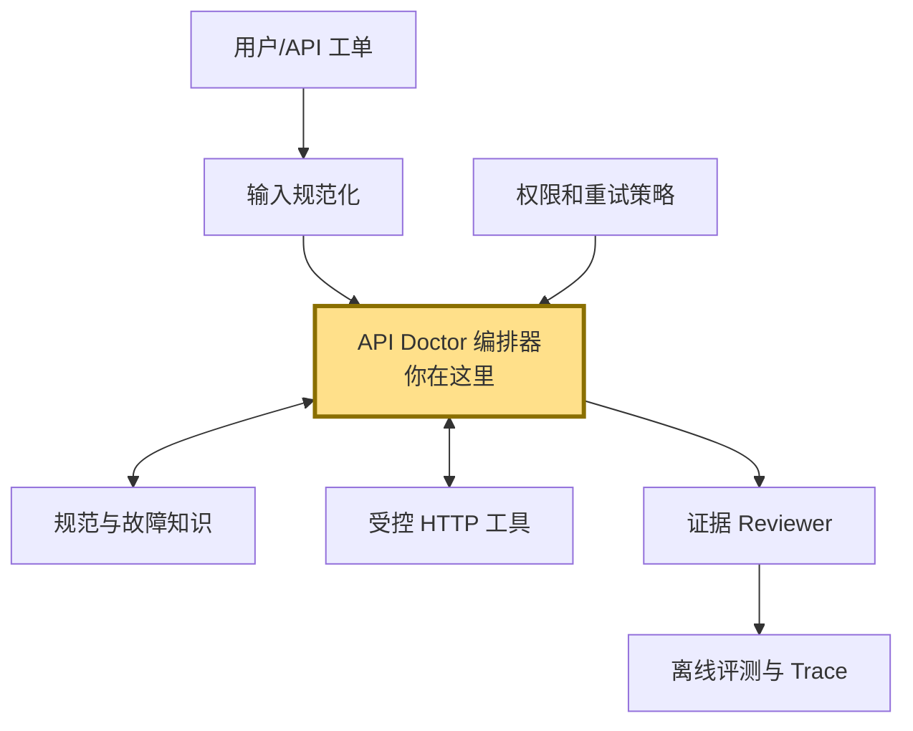

# 四家企业 JD 共性分析与项目优化结论

## 一句话概括

四家公司都在招聘能把“模糊业务问题”变成“可运行、可验证、可迭代 AI 系统”的工程型候选人；API Doctor 用一次接口故障的完整处理链，集中展示这组能力。

## 1. 公司分别想解决什么问题

| 企业 | 公司要解决的问题 | JD 中的落点 | API Doctor 对应证明 |
| --- | --- | --- | --- |
| 阿里 | 把 Agent 从单点 Demo 变成可规模化的业务增长工具 | 业务归因、Agent 架构、RAG/记忆、反思纠错、观测评测、高并发 | 故障归因、规则检索、重试纠错、Trace、离线 Case 集 |
| 腾讯 | 把模型能力交付成用户真正愿意使用的产品 | 需求到交付、产品体验、RAG、反馈优化闭环 | 明确 Persona、结构化报告、证据解释、成功指标 |
| 美团 | 构建稳定、可迭代的内部 AI 应用 | API、RAG、工具调用、工作流、后端、数据处理、监控 | Node API 服务、工具接口、编排、规则数据、评测指标 |
| 抖音 | 建设能够在真实研发环境执行并验证的 Agent Harness | 状态、规划、工具、记忆、权限、恢复、观测、评测、时延成本 | 主循环、尝试记忆、白名单、受控重试、Reviewer、Trace |

## 2. 哪些能力一直出现

| 能力 | 出现强度 | 项目中的载体 | 当前状态 |
| --- | --- | --- | --- |
| 业务问题拆解与产品交付 | 4/4 | PRD、Persona、成功指标 | 已设计 |
| 编码和软件工程 | 4/4 | TypeScript、模块边界、测试、HTTP 服务 | MVP 已实现 |
| LLM/Agent 基础机制 | 4/4 | Reasoner 接口、编排循环、Skill、Reviewer | 确定性版本已实现 |
| API/后端/工具调用 | 3/4 直接强调，4/4 实际需要 | `/api/debug`、HttpTool、JSON 契约 | Fixture 已实现 |
| 评测与反馈优化 | 3/4 强调 | 固定 Case、自动断言、Trace | MVP 已实现 |
| RAG/知识构建 | 3/4 | 规则库与检索接口 | 关键词检索已实现，向量检索待做 |
| 上下文、状态和记忆 | 2/4 明确强调 | Attempt 历史、规范、检索结果 | 内存态已实现 |
| 安全、权限和稳定性 | 抖音/阿里重点，生产系统必需 | Host 白名单、尝试预算、失败状态 | 基础版已实现 |
| 性能、成本、并发与部署 | 阿里/抖音重点 | Trace 时延字段、服务入口 | 尚缺压测、队列和部署 |

⭐ 这里是重点：项目不需要把每个关键词都做成独立功能。一次失败请求已经可以让需求建模、检索、工具调用、状态、纠错、权限、观测和评测在同一条链路中自然发生。

## 3. 面试可能沿哪里追问

| 起点 | 典型追问 | 项目应准备的证据 |
| --- | --- | --- |
| 为什么选 API 联调 | 用户是谁？真实价值是什么？为什么需要 Agent？ | Persona、人工流程、确定性逻辑与模型的分工 |
| 为什么用 Pi | 不用 LangGraph 行不行？为什么不自己写 Agent loop？ | Pi 负责模型/会话，领域 Harness 负责工具、策略和评测的边界图 |
| RAG 怎么做 | 分块、召回、排序、更新、如何评估？ | V0 规则检索基线；V1 OpenAPI/文档分块和 Recall@K 方案 |
| Agent 如何防幻觉 | 如果模型乱改参数怎么办？ | 规范证据、单次只改一处、Reviewer、最大尝试数 |
| 工具调用安全吗 | 会不会误打生产、泄露 Token、产生订单？ | Host 白名单、环境分级、敏感字段脱敏、写请求审批路线 |
| 如何证明有效 | 是不是只挑了能成功的例子？ | 固定 Case 集、基线对比、失败分类、回归命令 |
| 如何处理 429/超时 | 为什么重试？重试风暴怎么办？ | retry budget；后续指数退避、抖动和熔断设计 |
| 多 Agent 是否必要 | 为什么 Reviewer 要独立？成本是否值得？ | 单 Agent 基线；只在高风险结论上启用 Reviewer 的路由方案 |
| 如何产品化 | 多人、历史记录、部署、监控怎么办？ | V2-V5 路线、持久化、队列、OpenTelemetry 和 RBAC 设计 |
| 代码如何扩展 | 接真实模型会不会推倒重来？ | `Reasoner`、`HttpTool`、领域契约和编排器的稳定边界 |

## 4. 目前缺的是什么

以下判断只基于仓库中可验证的材料，不对个人未展示的经历作推断。

### 已补上的缺口

- 从“只有方案文档”变成了可编译、可运行、可测试的 TypeScript 工程。
- 有了一条端到端主链，而不是一组互不相连的 Agent 名词。
- 有固定数据、明确预期和自动评测，结果可以复现。
- 有后端 JSON API、权限边界、重试预算与 Trace。

### 仍然存在的关键缺口

1. **真实输入能力**：尚未解析 curl、OpenAPI 和任意 JSON 请求。
2. **真实模型与 Pi 接入**：Reasoner 还是确定性实现，不能证明 Prompt、上下文和模型失败处理。
3. **真实 RAG**：目前是小型关键词规则库，尚无文档解析、分块、Embedding、排序及召回评测。
4. **工程运行环境**：尚无数据库、任务队列、并发压测、容器部署和 CI。
5. **产品体验**：只有 CLI/HTTP API，没有用户界面和真实用户反馈。
6. **真实项目证据**：固定案例证明链路正确，但不能替代真实 API 的失败样本和用户使用记录。

## 项目全景图

## 结论

当前最优策略不是恢复通用桌面 Coding Agent，而是先把 API Doctor 的 V0/V1 做深：它更容易形成真实数据、清晰指标和可信 Demo，也能覆盖四家公司最重视的交付闭环。通用桌面 UI、五个子 Agent和插件市场都可以后置。
