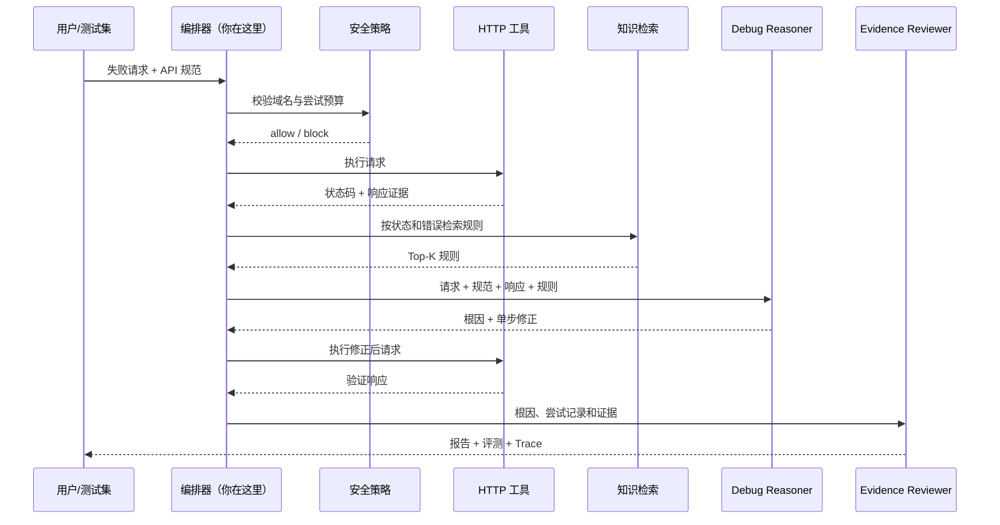

# API Doctor MVP PRD

## 1. 产品定义

| 项目 | 内容 |
| --- | --- |
| 产品 | L-Pilot / API Doctor |
| 版本 | V0.1 Deterministic MVP |
| 用户 | 初级开发者、SaaS 实施和技术支持人员 |
| 核心问题 | 面对失败的第三方 HTTP 请求，不知道应该先查什么、改什么、如何证明修好了 |
| 价值主张 | 用规范和真实响应作证据，自动定位一个根因、执行一个修正并复测 |

## 2. 用户故事

> 作为正在接入第三方 API 的初级开发者，我希望把失败请求和接口规范交给 Agent，让它在测试环境复现、定位、修正并给出证据，以便减少盲目试错。

## 3. MVP 核心目标

- 6 个受控案例全部完成输入到评测的端到端链路。
- 每一次 HTTP 调用、知识检索、诊断和复核都能在 Trace 中找到。
- 自动修改必须有响应或规范证据；没有证据时停止。
- 最多尝试 3 次，域名不在白名单时不得执行工具。
- 既提供 CLI 演示，也提供 JSON HTTP API。

## 4. 非目标

- 不在 MVP 中接生产 API、支付真单或用户真实 Token。
- 不实现通用聊天 UI、多租户、账号体系和收费。
- 不宣称关键词规则库等同于完整向量 RAG。
- 不为展示 Multi-Agent 而拆出无必要的多个模型调用。
- 不把进程级限制描述成强沙箱。

## 5. 最小核心链路

## 6. 功能需求与验收

| ID | 功能 | 验收标准 |
| --- | --- | --- |
| FR-01 | 统一请求模型 | method/url/headers/body 可以 JSON 序列化并贯穿全链 |
| FR-02 | Fixture HTTP 工具 | 401/415/422/405/429/200 行为可重复 |
| FR-03 | 规则检索 | 根据状态码和响应关键词返回最多 3 条规则 |
| FR-04 | 诊断与修正 | 能修正 Header、Body 类型、Method 或执行受控重试 |
| FR-05 | 状态与记忆 | 报告保留每次请求、响应和诊断，最多 3 次 |
| FR-06 | 安全策略 | 非白名单 Host 在工具执行前阻断，attempts 为 0 |
| FR-07 | 证据复核 | 根因、成功状态、证据完整性分别评分 |
| FR-08 | 可观测性 | 所有阶段生成单调递增 seq、状态和耗时 |
| FR-09 | 服务接口 | `GET /health`、`POST /api/debug` 可返回 JSON |
| FR-10 | 自动测试 | 一条命令编译并跑完成功链、阻断链和 Trace 测试 |

## 7. 固定数据集

| Case | 初始现象 | 预期根因 | 预期动作 |
| --- | --- | --- | --- |
| auth-header | 401 | AUTH_HEADER_FORMAT | 补正确 Bearer 格式 |
| content-type | 415 | CONTENT_TYPE_MISMATCH | 改为 application/json |
| body-type | 422 | BODY_TYPE_MISMATCH | amount 转 number |
| http-method | 405 | HTTP_METHOD_MISMATCH | GET 改 POST |
| rate-limit | 429 | RATE_LIMIT_TRANSIENT | 预算内重试 |
| healthy | 200 | NONE | 不修改 |
| bad-host | 执行前 | Policy block | 不调用 HTTP 工具 |

## 8. 成功指标

| 指标 | MVP 门槛 |
| --- | --- |
| 固定案例端到端通过率 | 100% |
| 根因匹配率 | 100%（固定集） |
| 修正后请求成功率 | 100%（固定集） |
| 越权 Host 执行次数 | 0 |
| Trace 完整率 | 100% |
| 单 Case 最大尝试数 | ≤ 3 |

这些指标只证明 Harness 和确定性基线正确，不代表真实模型上的泛化效果。

## 9. Demo 脚本

1. 运行 `npm test`，证明主链和安全边界可回归。
2. 运行 `npm run demo`，展示 6 个 Case 的根因、尝试数和结果。
3. 运行 `npm run serve`，通过 `/api/debug` 调用 `auth-header`。
4. 展开返回的 attempts 与 trace，解释“结论来自哪里”。
5. 把 URL 改成非白名单 Host，展示工具执行前阻断。
