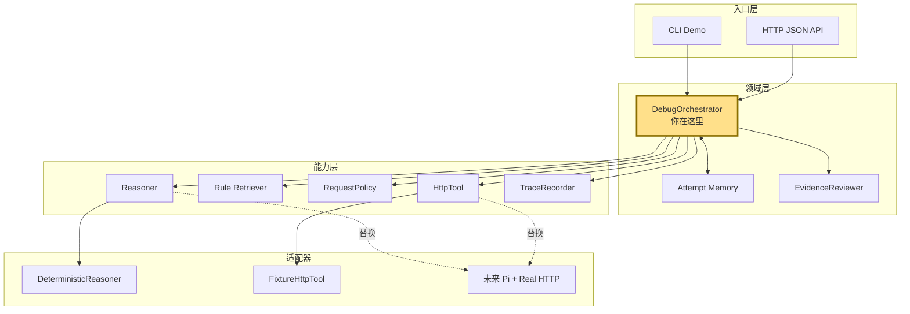
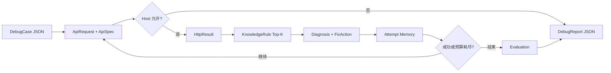
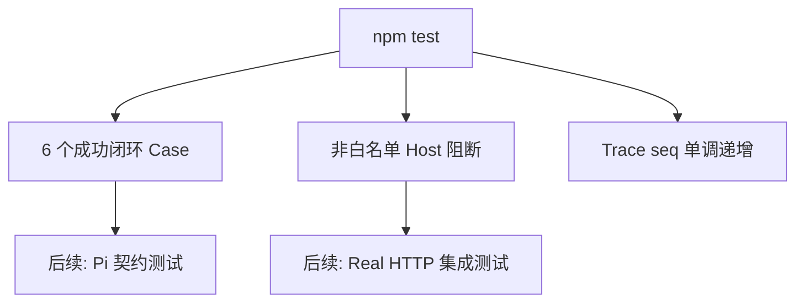

# API Doctor 架构、数据流与验证设计

## 一句话结论

这是一个 **Agent Harness**（大白话：约束并监督 Agent 如何工作的运行骨架），当前用确定性 Reasoner 替代模型，因此可以先验证编排、工具、安全和评测，再无痛替换为 Pi。

## 1. 技术栈速览

| 维度 | 技术选型 | 大白话解释 |
| --- | --- | --- |
| 语言 | TypeScript / Node.js 20+ | 用类型先约束 JSON 数据，减少接口对不上 |
| 服务 | Node `http` | 不引入 Web 框架，先证明 API 主链 |
| 状态 | 单次运行内存 | attempts 就是当前任务的短期记忆 |
| RAG 基线 | 关键词 + 状态码 Top-K | 从小规则库找相关排障知识 |
| Agent | `Reasoner` 接口 | 当前确定性，后续换 Pi/LLM |
| 测试 | `node:test` | 无测试框架依赖的自动回归 |

## 2. 总体架构

## 3. 输入到输出的数据流

数据契约的关键点：

- `ApiRequest` 是所有输入适配器的共同出口；未来 curl/OpenAPI/Postman 都先转成它。
- `HttpResult` 是 Fixture、fetch、MCP HTTP 工具的共同出口。
- `Reasoner` 只消费结构化上下文，既可以由规则实现，也可以由 Pi 实现。
- `DebugReport` 同时服务 CLI、HTTP API、未来 UI 和离线评测。

## 4. 逐跳代码映射

| 跳 | 文件 | 关键入口 | 作用 |
| --- | --- | --- | --- |
| 1 | `src/fixtures/cases.ts` | `getCase` | 提供受控输入和预期答案 |
| 2 | `src/core/orchestrator.ts` | `DebugOrchestrator.run` | 控制整条执行循环 |
| 3 | `src/security/request-policy.ts` | `assertAllowed` | 工具前阻断越权目标 |
| 4 | `src/tools/fixture-http-tool.ts` | `execute` | 模拟真实 HTTP 状态和响应 |
| 5 | `src/knowledge/rules.ts` | `retrieveRules` | 检索与当前错误相关的知识 |
| 6 | `src/agent/deterministic-reasoner.ts` | `diagnose` | 产出根因、证据和单步动作 |
| 7 | `src/agent/reviewer.ts` | `review` | 独立检查成功、根因和证据 |
| 8 | `src/observability/trace.ts` | `span` | 记录阶段、状态、耗时和错误 |
| 9 | `src/server.ts` | `/api/debug` | 对外暴露 JSON API |

## 5. 关键决策点

| 条件 | 走向 A | 走向 B |
| --- | --- | --- |
| Host 是否在白名单 | 执行 HTTP 工具 | 阻断并返回 blocked |
| HTTP 是否 2xx | 进入 Reviewer | 检索知识并诊断 |
| Reasoner 是否有动作 | 应用单步修改 | stop 并保留证据 |
| 是否还有尝试预算 | 重试 | 返回 unresolved |
| Reviewer 是否全部通过 | resolved/passed | resolved 或 unresolved，但评测失败 |

## 6. 为什么现在不用真实模型

真实模型会同时引入 Prompt、输出格式、工具选择、上下文长度、网络和 Provider 错误。如果基础编排本身有 Bug，很难区分是哪一层造成的。当前确定性实现相当于“可预测的假驾驶员”，先验证车辆的刹车、仪表和道路规则。

接入 Pi 时只新增 `PiReasoner implements Reasoner`：

1. 把 request/spec/result/rules 组装为受控上下文。
2. 加载 `.pi/skills/api-doctor/SKILL.md`。
3. 要求模型输出符合 `Diagnosis` 的 JSON Schema。
4. Schema 校验失败时重试一次，仍失败则 stop。
5. 原有 Policy、HttpTool、Reviewer、Trace 和测试集保持不变。

## 7. 测试设计

当前测试回答三个问题：主链能否跑通、安全边界是否在工具之前生效、运行轨迹能否稳定重放。下一阶段才测试模型泛化和真实网络异常。

## 8. 新手易踩坑

1. ⚠️ 不要把固定集 100% 通过宣传成真实场景准确率；它只是工程基线。
2. ⚠️ 不要把规则检索宣传成完善 RAG；下一版必须有独立召回评测。
3. ⚠️ 不要在 Trace 中记录真实 Authorization；当前 Fixture 是假 Token，接真实工具前要加统一脱敏。
4. ⭐ `DebugOrchestrator.run` 是必看的主干，其他文件都是它调用的能力模块。

## 9. 推荐阅读顺序

| 顺序 | 文件 | 为什么先看 |
| --- | --- | --- |
| 1 | `src/domain/types.ts` | 先认识整条链路运送的数据 |
| 2 | `src/core/orchestrator.ts` | 看清主循环和停止条件 |
| 3 | `src/fixtures/cases.ts` | 理解输入与标准答案 |
| 4 | `src/agent/deterministic-reasoner.ts` | 理解诊断动作如何产生 |
| 5 | `test/orchestrator.test.ts` | 看系统如何证明自己正确 |
