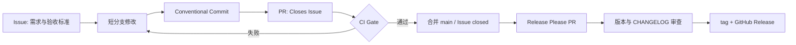

# CI/CD 工作流设计

## 目标

把 A-Pidoc 的每次改动组织成可追踪、可验证、可回滚的闭环：



## 方案调研与选择

数据快照日期：2026-09-05。Stars 只表示社区采用度，最终选择还同时考虑维护活跃度、单包适配、审计性和接入成本。

| 方案 | GitHub Stars（约） | 优点 | 对本项目的主要代价 | 结论 |
| --- | ---: | --- | --- | --- |
| semantic-release | 24k | 全自动判断 SemVer、生成说明并发布，生态最大 | 主分支提交后直接发布；配置与插件较重，对提交规范依赖强 | 成熟，但 V0 阶段自动化过于激进 |
| Changesets | 12.4k | 多包版本联动、变更意图显式、适合 monorepo | 每个 PR 多维护 changeset 文件；单包仓库收益有限 | 未来变为 monorepo 时再评估 |
| release-please | 7.4k；Action 2.4k | Google 维护；把待发布变更汇总成可审查 PR，合并后才 tag/release | 比完全自动发布多一次人工合并 | 当前最佳：透明、可审计、低成本 |

采用 GitHub Actions + Release Please。工作流内第三方 Action 使用完整 commit SHA 固定，旁注对应版本，避免浮动 tag 被替换带来的供应链风险。

## 从文章落地到当前版本

文章强调 AI 系统有代码、模型参数、Prompt、Tools、Skills、MCP、评测集和数据等多类变更源，不应混在一次发版；PR 除传统构建和单测外，还应有分层 Eval Gate、成本/延迟预算和影响范围分析。

当前 V0 还没有真实模型和线上流量，因此分阶段落地：

| 项目阶段 | PR Gate | 定期/发版 Gate | 发布方式 |
| --- | --- | --- | --- |
| V0（当前） | 编译 + 3 组测试，覆盖 6 个固定诊断 Case、越权阻断与 Trace | 同一确定性 Tier A，100% 通过 | Release PR → SemVer tag → GitHub Release |
| V1（Pi/真实输入） | Tier A 冒烟 + 受影响 Case；真实模型 `n_runs >= 3` | Nightly Tier B；统计准确率、成本、p95 延迟 | 模型/Prompt/Skill 分 PR，锁定具体版本 |
| V2（项目级助手） | 契约测试、补丁前后回归、安全策略 | 多示例仓库冻结集，失败聚类 | Release Artifact；部署只消费已发布 tag |
| V3+（服务化） | 数据/Schema 兼容性、迁移与回滚检查 | Nightly/weekly/red-team、回放与 A/B 指标 | 独立变更通道、多维灰度、自动回滚 |

## GitHub 仓库设置

首次推送后需要在 GitHub 完成两项仓库级设置：

1. 为 `main` 建立 Ruleset，禁止直接 push，并要求 `Build, unit tests, and Tier A eval` 检查通过。
2. 创建只授权本仓库的 fine-grained PAT，授予 Contents 与 Pull requests 的 Read and write 权限，并保存为 Actions Secret `RELEASE_PLEASE_TOKEN`。这样 Release Please 创建的 PR 才会像普通 PR 一样触发 CI。

仓库内不保存 PAT、npm token 或模型密钥。`RELEASE_PLEASE_TOKEN` 只保存在 GitHub Actions Secrets；当前项目不需要 npm token 或模型密钥。

## 日常使用

```bash
# 本地门禁
npm ci
npm run check

# 提交示例
git commit -m "fix: block redirects to untrusted hosts"
git commit -m "feat: accept curl input"
```

PR 描述中写 `Closes #123`。合并功能 PR 后，Release Please 会创建或更新 Release PR；只有合并 Release PR 才正式发版。

## 参考

- 腾讯云：《AI 工程的 CI/CD：从模型发版到 Skill 灰度的完整流水线》
- GitHub Docs：Releasing and maintaining actions、GitHub flow、workflow permissions
- GitHub：semantic-release/semantic-release、changesets/changesets、googleapis/release-please
