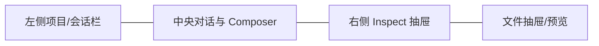
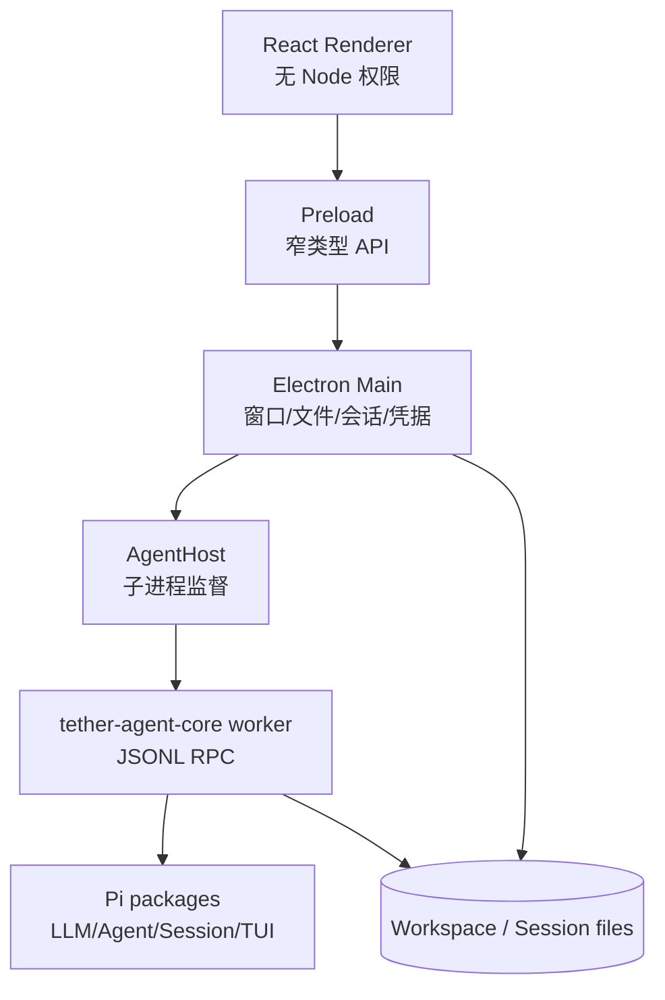
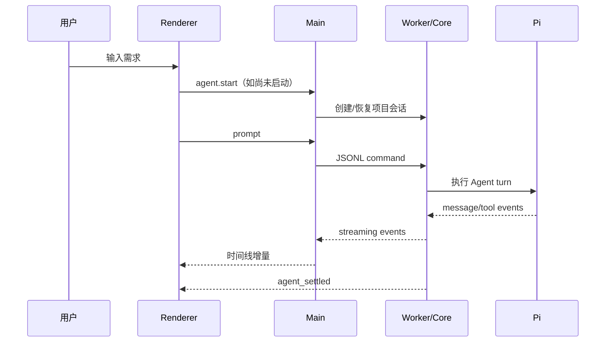

# Tether 功能实现与设计分析

## 1. 研究范围

分析对象为 [tt-11-dd/tether-ai](https://github.com/tt-11-dd/tether-ai/tree/c8db7d0a088c799647908bf5383cf9ab6b4fb1b5)，快照 `c8db7d0`（2026-08-22），桌面版本 `0.2.7`；同时检查其 npm 依赖 `tether-agent-core@0.1.15`。关键入口包括 [Electron 主进程](https://github.com/tt-11-dd/tether-ai/blob/c8db7d0a088c799647908bf5383cf9ab6b4fb1b5/src/main/index.ts)、[preload](https://github.com/tt-11-dd/tether-ai/blob/c8db7d0a088c799647908bf5383cf9ab6b4fb1b5/src/preload/index.ts)、[React App](https://github.com/tt-11-dd/tether-ai/blob/c8db7d0a088c799647908bf5383cf9ab6b4fb1b5/src/renderer/src/App.tsx) 和 [AgentHost](https://github.com/tt-11-dd/tether-ai/blob/c8db7d0a088c799647908bf5383cf9ab6b4fb1b5/src/main/agent-host.ts)。

## 2. 产品定位

Tether 是一个本地优先的桌面 coding agent。它没有把 Pi 的终端界面原样搬进 Electron，而是重新组织为“项目—会话—执行过程—文件变更”四个产品对象，让不习惯终端的用户也能监督 Agent 改代码。

其核心体验可概括为：

1. 选择本地项目。
2. 在聊天框描述需求。
3. Agent 流式展示思考、工具调用和终端输出。
4. 用户在右侧查看文件、计划、变更与运行状态。
5. 会话保存后可恢复、命名、置顶、归档或撤销最近修改。

## 3. 功能地图

| 区域 | 已实现能力 | 产品价值 |
| --- | --- | --- |
| 项目与会话 | 最近项目、项目内会话、新会话、恢复、重命名、置顶、归档 | 把聊天绑定到真实代码目录 |
| 对话 | Markdown、thinking、工具卡片、终端块、流式增量、停止、steer | 让执行过程可见、可打断 |
| Composer | 文件 `@` 引用、URL、图片粘贴/拖入、模型、思考等级、权限模式、上下文统计 | 在一个入口完成任务描述与运行配置 |
| Inspect | 文件树、Git/文件变更、待办/计划、终端状态、撤销 | 将“说了什么”和“实际改了什么”并列呈现 |
| 设置 | 模型凭据、兼容 API 配置、视觉模型、主题、技能、快捷键、更新 | 把 Pi 的配置能力产品化 |
| 会话控制 | `/compact`、`/undo`、计划批准/细化 | 管理长上下文与高风险修改 |

## 4. 前端设计思路

### 4.1 页面骨架

- 左侧是稳定导航：品牌、新会话、项目及其嵌套会话。
- 中央是主任务流：空状态首页、消息时间线、流式运行、输入框。
- 右侧是监督面：文件、变更、计划、终端、撤销。
- Inspect 宽度可调，默认约 268px，约束在 220–480px。

### 4.2 视觉语言

Tether 的默认主题接近纸张和编辑器的混合风格：页面底色 `#f6f4f0`，内容面 `#fffcf8`，主文字 `#1c1917`，品牌棕色 `#8a6f5a`。它使用细边框、轻阴影、低饱和强调色和 Inter/系统等宽字体，工具调用采用紧凑行而不是大面积卡片。

这套风格的价值不是“好看”本身，而是降低长时间阅读的视觉噪音：对话是主角，工具与状态默认收敛，需要时再展开。

### 4.3 状态建模

Renderer 并不直接展示 Pi 的原始事件，而是把消息、tool call、diff、terminal、todo 和 delegate 进度归一化成 UI 模型。其 [conversation adapter](https://github.com/tt-11-dd/tether-ai/blob/c8db7d0a088c799647908bf5383cf9ab6b4fb1b5/src/renderer/src/conversation.ts) 负责：

- 将流式事件聚合为稳定的 turn；
- 从工具输入/输出提取工作文件、终端、计划与变更；
- 将并行或中断的工具调用变成可理解的时间线；
- 对 Markdown 表格、diff 和错误状态做显示修复。

这是 Tether 最值得复用的思路之一：运行协议和视图模型必须分层，否则 UI 会被 Agent 事件细节绑死。

## 5. 后端与 Agent 实现

### 5.1 进程与信任边界

Electron 启用 `contextIsolation`、关闭 `nodeIntegration`、启用 renderer sandbox；新窗口和页面导航被阻断，HTTP(S) 链接交给系统浏览器。Renderer 只能通过 `window.harness` 的白名单 API 访问主进程。

Agent 运行在独立子进程中，通过 LF 分隔的 JSONL 请求/事件通信。这样可以：

- 防止 Agent 崩溃直接拖垮 UI；
- 对命令设置超时、取消和进程树清理；
- 在窗口退出时统一终止后代进程；
- 保持 Electron 主进程不被长时间工具执行阻塞。

### 5.2 Tether 对 Pi 的增强层

Tether 并非只启动 Pi。`tether-agent-core` 在 Pi 之上补充了：

- `plan / ask / auto / full` 权限模式；
- 文件读取、搜索、诊断、原子补丁、长命令和 stdin 工具；
- `tool_call` 前的命令风险与网络访问分类；
- macOS Seatbelt 沙箱、实验性 Windows 沙箱及不可用时的降级确认；
- 写入前后哈希检查点、会话持久化和撤销信息；
- 技能、计划、子 Agent、MCP、hooks 等扩展能力；
- JSONL 会话原文与 SQLite 元数据索引。

因此，“Pi 是内核，Tether Core 是 harness 策略层，Electron 是产品壳”才是准确拆分。

### 5.3 工作区安全

主进程文件访问使用两层约束：先验证规范化路径仍位于 workspace 下，再解析最近存在父目录的真实路径，防止符号链接绕出工作区。文件读取有大小和二进制限制，目录枚举有数量/深度上限并跳过 `.git`、`node_modules` 和构建目录。

命令审批使用规则分类，真实安全边界则依赖可用的 OS 沙箱。规则分类适合决定“是否弹窗”，不能被当作完整 shell 解析器或安全沙箱。

### 5.4 会话与恢复

Pi JSONL transcript 是会话事实来源；SQLite WAL 只保存可搜索的标题、时间、项目、置顶/归档等索引。Tether 使用日期分区目录，并为 Pi 兼容保留扁平路径。

检查点记录文件修改前后哈希。Core 的撤销可在文件已被用户再次修改时拒绝覆盖，这是比简单 `git checkout` 更安全的设计。

## 6. 关键流程

### 6.1 发送任务

运行中再次输入普通文本会转成 steer，而不是开启并发 turn；停止会 abort 当前 turn。Settled 后 UI 刷新上下文统计与会话列表。

### 6.2 修改与撤销

Agent 的补丁工具限制在 workspace 内，成功写入后将路径、前后哈希和恢复数据附加到会话。用户触发 `/undo` 时，UI 从最近 turn 提取恢复范围并要求确认。

## 7. 优点与局限

### 优点

- 产品对象清晰：项目、会话、turn、工具、变更各司其职。
- Renderer/Main/Worker 三重边界适合桌面 Agent。
- Pi transcript 保持事实来源，避免自建一套对话协议。
- 变更、审批、停止、steer、compact 构成完整的监督闭环。
- Tether 风格对工具细节做渐进披露，适合 vibecoding 用户。

### 局限与风险

- `App.tsx`、`ui.tsx` 和 CSS 文件体积很大，早期开发快，但继续扩展会提高回归成本。
- 桌面设置主要暴露 DeepSeek 与 OpenAI-compatible 配置，Core 的多 Provider 能力没有完全产品化。
- macOS 沙箱较完整；Windows 仍属实验能力，Linux 桌面缺少同等强度的安全执行层。
- 命令风险/网络分类依赖启发式规则，不能替代 OS 隔离。
- 本地文件凭据虽设置严格权限，仍是磁盘明文秘密，威胁模型弱于系统 keychain。
- Renderer 发起的 workspace restore 路径应继续核对是否完整复用 Core 的冲突哈希校验，避免 UI 撤销绕过安全检查。
- 仓库 README 声明 MIT，但该快照根目录未见 LICENSE；其 npm Core 包含 MIT LICENSE。复制实现前应向维护者确认仓库许可边界。

## 8. 对 A-Pidoc 的直接启示

应复用：三栏信息架构、独立 Agent 进程、窄 IPC、Pi JSONL 事实来源、运行事件适配层、审批与冲突安全撤销。

不应照搬：私有 `tether-agent-core`、过大的单体组件、MCP/多 Agent/视觉专用模型、SQLite 双存储、复杂计划批准和跨平台强沙箱承诺。它们超出简单 vibecoding MVP。

