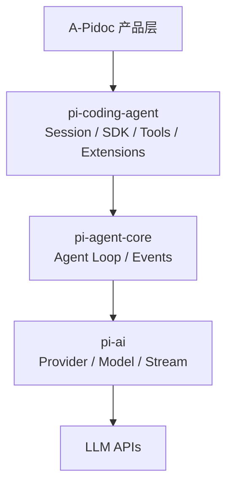

# Pi 内核分析与接入边界

## 1. 研究对象

分析基于 [earendil-works/pi](https://github.com/earendil-works/pi/tree/74786a748f5314cc2127ebbcfa2d732e9b8433f5) 快照 `74786a7`（2026-08-22），包版本 `0.84.2`。主要依据为 [coding-agent README](https://github.com/earendil-works/pi/blob/74786a748f5314cc2127ebbcfa2d732e9b8433f5/packages/coding-agent/README.md)、[SDK 文档](https://github.com/earendil-works/pi/blob/74786a748f5314cc2127ebbcfa2d732e9b8433f5/packages/coding-agent/docs/sdk.md)、[RPC 文档](https://github.com/earendil-works/pi/blob/74786a748f5314cc2127ebbcfa2d732e9b8433f5/packages/coding-agent/docs/rpc.md)、[扩展文档](https://github.com/earendil-works/pi/blob/74786a748f5314cc2127ebbcfa2d732e9b8433f5/packages/coding-agent/docs/extensions.md) 与 [安全说明](https://github.com/earendil-works/pi/blob/74786a748f5314cc2127ebbcfa2d732e9b8433f5/packages/coding-agent/docs/security.md)。

## 2. Pi 是什么

Pi 不是一个完整桌面产品，而是一组可组合的 Agent 构件：

| 包 | 职责 | A-Pidoc 是否直接使用 |
| --- | --- | --- |
| `pi-ai` | 多 Provider 模型、流式响应、消息格式和用量 | 间接使用 |
| `pi-agent-core` | Agent loop、tool calling、状态与事件 | 间接使用 |
| `pi-coding-agent` | coding tools、会话、资源加载、SDK/RPC、扩展 | **直接使用** |
| `pi-tui` | 终端 UI | 不用于桌面 Renderer |
| `pi-protocol/server/client` | 实验性远程协议/服务组件 | MVP 不使用 |

## 3. 原生可复用能力

### 3.1 AgentSession

`createAgentSession()` 返回的 `AgentSession` 管理模型、消息、Agent 生命周期、压缩和流式事件。关键 API 包括：

- `prompt()`：发送文本/图片任务并等待完整运行；
- `steer()` / `followUp()`：运行中改变方向或排队后续任务；
- `subscribe()`：接收 message、tool、turn、retry、compaction 等事件；
- `abort()`：取消当前运行；
- `compact()`：压缩长上下文；
- `setModel()` / thinking level：运行中切换模型配置。

需要跨会话切换、恢复和 fork 时，使用 `createAgentSessionRuntime()`，而不是在一个 `AgentSession` 上强行替换状态。

### 3.2 会话模型

Pi 将会话保存为 JSONL，每条记录包含 `id` 与 `parentId`，因此一个文件内可以形成分支树。完整历史始终保留，compaction 只改变送给模型的活动上下文，不删除原始 transcript。

这意味着 A-Pidoc 无需自建聊天数据库；只需维护一个轻量项目/会话目录缓存，展示层从 JSONL 派生。

### 3.3 资源系统

`DefaultResourceLoader` 可加载：

- `AGENTS.md` 等上下文文件；
- Skills；
- Prompt templates；
- TypeScript Extensions；
- 项目级和用户级配置。

Pi 有 project trust 机制，用于决定是否加载项目内的动态扩展与设置。注意：这是“是否信任项目配置”，不是对 Agent shell/file 行为的权限系统。

### 3.4 扩展钩子

扩展可注册自定义工具、命令和生命周期监听。对 harness 最重要的是：

- `tool_call` 在工具执行前触发，可修改参数或 `{ block: true }` 阻止执行；
- `tool_result` 在结果进入会话前触发，可补充审计元数据；
- `before_agent_start` 可调整 system prompt；
- `agent_settled` 表示重试、自动压缩和队列全部结束；
- session hooks 可监听新建、恢复、fork、compact 和 shutdown。

Pi 自带的 [git-checkpoint 扩展示例](https://github.com/earendil-works/pi/tree/74786a748f5314cc2127ebbcfa2d732e9b8433f5/packages/coding-agent/examples/extensions) 也证明检查点属于扩展层，而不是 Agent Core 的固定职责。

## 4. SDK 与 RPC 取舍

| 维度 | SDK | `pi --mode rpc` |
| --- | --- | --- |
| 集成语言 | Node/TypeScript 最佳 | 任意语言 |
| 事件访问 | 直接强类型订阅 | JSONL 协议映射 |
| 自定义工具/审批 | 内联扩展最自然 | 需加载扩展并映射 extension UI |
| 进程隔离 | 应用自行放入 Worker | 天然子进程 |
| 协议维护 | 内部 API 随版本升级 | RPC 命令面相对稳定 |
| 官方建议 | Node 应用优先 AgentSession | 非 Node 或明确子进程集成 |

A-Pidoc 选择“**SDK 装在独立 Node 子进程**”：既获得 Tether 式故障隔离，又保留 SDK 对工具、事件和会话的精细控制。Main 与 Worker 之间自定义一个很小的 JSONL 协议，而不是把整个 Pi RPC 原样暴露给 Renderer。

## 5. Pi 明确不负责的能力

Pi 的设计哲学明确写出“无内置 permission popups”，并建议使用容器或扩展实现自己的确认流。以下能力必须由 A-Pidoc 补齐：

| 缺口 | A-Pidoc 责任 |
| --- | --- |
| 文件边界 | 规范化路径 + realpath/symlink 检查，只允许 workspace |
| 写入审批 | Review/Ask/Auto 策略和一次性批准 |
| shell 审批 | 命令展示、风险标记、超时、进程树取消 |
| 强隔离 | MVP 明示不提供；后续接 Docker/Seatbelt/Windows Sandbox |
| 变更恢复 | 修改前后哈希、原子写入、冲突安全撤销 |
| UI 状态 | 将细粒度 Pi event 聚合为 turn/tool/diff 视图 |
| 凭据展示 | 安全设置页，不把密钥回传 Renderer |

## 6. 内核接入原则

1. 不 fork Pi，不修改其 Agent loop。
2. `pi-coding-agent` 固定精确版本，由适配器吸收上游变化。
3. JSONL transcript 保持会话事实来源。
4. 不直接启用 Pi 的 `write/edit/bash` 内置工具；MVP 用 A-Pidoc 安全包装工具替代，避免审批只停留在 UI。
5. Project trust 默认拒绝项目动态扩展；用户明确启用后才加载 `.pi` 扩展。
6. Renderer 只消费 A-Pidoc 领域事件，不依赖 Pi 原始事件字段。

## 7. 升级风险

- Pi 仍快速演进，应使用精确版本和契约测试，不使用宽松 `^` 范围。
- 扩展钩子、session entry 与 model auth API 是最容易影响适配层的接口。
- JSONL 解析必须容忍未知 entry type，不能因上游增加字段而丢失会话。
- 升级门禁应覆盖：新会话、恢复、流式文本、工具执行、abort、steer、compact、模型切换和旧 transcript 回放。

