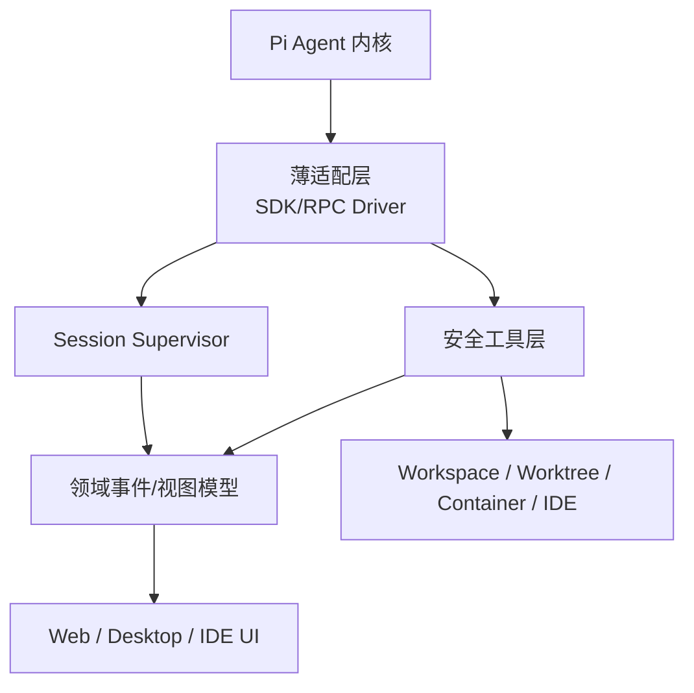

# Pi Harness 生态与扩展思路

## 1. 调研口径

“以 Pi 为核心”分为三类：

1. **直接嵌入上游 Pi SDK/RPC**：最适合 A-Pidoc 借鉴。
2. **Pi 深度分叉**：适合观察能力上限，但维护成本远高于 MVP。
3. **受 Pi 启发的重写**：可借鉴边界设计，不能视为 Pi 插件生态。

调研时间为 2026-08-23。项目能力按各仓库 README 与源码快照整理，不构成成熟度或安全性背书。

## 2. 直接基于上游 Pi 的项目

| 项目 | 形态 | 核心做法 | 可借鉴点 | 不宜放入 MVP |
| --- | --- | --- | --- | --- |
| [agegr/pi-web](https://github.com/agegr/pi-web) | 本地 Next.js Web | 直接使用 Pi 配置/会话，浏览器管理模型、资源、文件和 Git worktree | Pi 原生状态兼容、loopback 默认、文件预览、离线/PWA | 远程暴露、完整包管理器、复杂预览器 |
| [jmfederico/pi-web](https://github.com/jmfederico/pi-web) | 持久化 Web 服务 | server + session daemon，真实 workspace 中保持多会话运行，WebSocket 控制 | session supervisor、断线续跑、machine/project/workspace/session 分层 | 多机器、服务安装器、插件 API、并行会话控制面 |
| [minghinmatthewlam/pi-gui](https://github.com/minghinmatthewlam/pi-gui) | Electron 桌面 | `pi-sdk-driver` 薄适配，Pi JSONL 为事实源；worktree、PTY、diff、多 Agent | 与 A-Pidoc 最接近：typed IPC、SDK driver、timeline、diff | 每线程 worktree、多 Agent 编排、完整 PTY |
| [rcarmo/piclaw](https://github.com/rcarmo/piclaw) | 自托管一体化工作区 | Bun/Preact + Pi，SQLite 持久化、容器、SSE、编辑器/终端/媒体/MCP/自动化 | 容器是权限边界、工具按需加载、插件 pane、运行可观察性 | 功能面过大、双事实源、远程认证和自动化平台 |
| [pithings/pi-vscode](https://github.com/pithings/pi-vscode) | VS Code 插件 | 终端运行 Pi；本地 bridge 暴露 selection、diagnostics、symbols、code actions | 宿主 IDE 上下文注入、让编辑器处理脏缓冲和 workspace edit | 独立桌面无需复刻全部 LSP/IDE API |
| [tmustier/pi-for-excel](https://github.com/tmustier/pi-for-excel) | Excel 侧栏 Agent | 基于 Pi core，领域工具替代通用 coding tools；每次变更自动 checkpoint | 领域工具最小化、变更后验证、自动上下文、恢复闭环 | Office bridge、表格专用工具、侧栏微应用市场 |
| [preinpost/pi-web-chat](https://github.com/preinpost/pi-web-chat) | 轻量 Web UI | Node + Pi SDK + WebSocket，以 Pi package 方式安装 | 极小可运行壳、SDK 事件到 WebSocket 的直接映射 | 功能与安全边界不足以直接做桌面产品 |
| [baryonlabs/pi-agent-harness](https://github.com/baryonlabs/pi-agent-harness) | Pi package | Agent/skill/prompt 模板 + subagent 工具生成多 Agent 团队 | 扩展应优先打包为 Pi package，不侵入内核 | MVP 不需要团队生成与 subagent 编排 |

## 3. 分叉与启发项目

| 项目 | 血缘 | 观察价值 | 结论 |
| --- | --- | --- | --- |
| [can1357/oh-my-pi](https://github.com/can1357/oh-my-pi) | Pi 深度分叉 | 大量工具、Rust native core、LSP/DAP、遥测与协作面 | 展示“全能 harness”上限，也展示长期 fork 成本；A-Pidoc 不走此路 |
| [huggingface/tau](https://github.com/huggingface/tau) | 受 Pi 启发的 Python 重写 | `AgentHarness → CodingSession → TUI` 的清晰层次，适合架构教学 | 可借鉴脑/环境/界面分层，但不能直接复用 Pi 生态 |

## 4. 同类项目共同设计模式

### 模式 A：保持 Pi 为事实来源

pi-gui、agegr/pi-web 都尽量复用 Pi 的 auth、模型和 JSONL 会话。这样 CLI 与 GUI 可共享状态，也减少双写一致性问题。A-Pidoc 应采用相同策略。

### 模式 B：宿主能力通过窄桥注入

pi-vscode 不让 Agent 猜编辑器状态，而是通过 bridge 提供 selection、diagnostics 和 workspace edits。A-Pidoc 对文件系统也应使用窄工具，而不是把整个 Node API 暴露给模型。

### 模式 C：长运行与 UI 生命周期分离

jmfederico/pi-web 用 session daemon，Tether/pi-gui 用主进程监督运行。共同点是浏览器窗口或 React 组件不是 Agent 生命周期拥有者。

### 模式 D：变更必须可看、可验证、可恢复

pi-gui 的 diff、Pi for Excel 的 mutation verification/checkpoint、Tether 的 restore 都说明：coding agent 的核心 UX 不是聊天，而是变更监督闭环。

### 模式 E：先限制工具，再扩展能力

Pi for Excel 用少量领域工具；PiClaw 采用 staged tool loading。工具过多会增加 prompt 体积、选择错误和权限面。MVP 只需要 read/search/edit/exec 四类工具。

## 5. 可演进的扩展路线

### 第一层：MVP 必须具备

- Pi SDK driver 与版本契约测试；
- 项目/会话/对话/工具时间线；
- 工作区安全文件工具与命令审批；
- 文件预览、变更 diff、冲突安全撤销；
- 模型选择、停止、steer、compact；
- Tether 风格三栏桌面 UI。

### 第二层：验证产品后再做

- Git worktree 隔离会话，借鉴 pi-gui；
- 本地浏览器访问与断线续跑，借鉴两个 pi-web；
- IDE bridge/LSP diagnostics，借鉴 pi-vscode；
- Skills/Prompt 管理页，直接复用 Pi resource loader；
- 容器执行后端，借鉴 PiClaw，形成真正的 Linux 安全边界。

### 第三层：平台化能力

- 多 Agent/子 Agent、调度与预算；
- 远程机器和多 workspace supervisor；
- MCP、插件市场和第三方 pane；
- 组织策略、SSO、审计导出和集中密钥管理。

这些能力都应通过稳定的 Driver、ToolPolicy 和 Event Adapter 接口接入，不能侵入 Pi Agent loop。

## 6. 对 A-Pidoc 的选择结论

A-Pidoc 的最近参考物不是“大而全”的 PiClaw/Oh My Pi，而是：

`Tether 的产品交互 + pi-gui 的薄 SDK driver + Pi for Excel 的安全变更闭环 + agegr/pi-web 的 Pi 状态兼容`。

该组合能以最少代码形成可信的 coding agent，而不会在第一版变成远程 Agent 平台。

