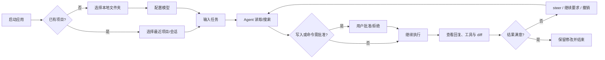
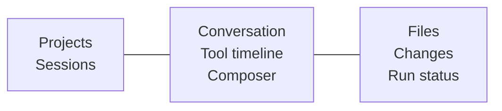

# A-Pidoc 产品需求文档（PRD）

## 1. 文档信息

| 项 | 内容 |
| --- | --- |
| 产品 | A-Pidoc Desktop |
| 版本 | MVP / 0.1 |
| 日期 | 2026-08-23 |
| 内核 | `@earendil-works/pi-coding-agent` |
| 形态 | 本地 Electron 桌面应用 |
| 目标 | 用自然语言在本地项目中完成小到中等规模的编码修改 |

## 2. 产品定义

A-Pidoc 是一个面向个人开发者的本地 coding agent。用户选择代码目录、描述需求，Agent 读取文件、修改代码、运行命令，并在同一界面展示过程、变更和撤销入口。

它不是 IDE，也不是团队 Agent 平台。MVP 只解决一个问题：**让用户在可看、可停、可确认、可恢复的前提下完成一次 vibecoding 任务。**

## 3. 目标与非目标

### 3.1 产品目标

- 首次安装后 5 分钟内完成首次有效任务。
- 从任务输入到代码修改、测试结果和 diff，全流程不离开应用。
- 默认情况下，Agent 不能写出当前 workspace。
- 任一 Agent 文件修改都能关联到一个 turn，并可在未冲突时撤销。
- 复用 Pi 的模型、会话和上下文能力，不自建 Agent loop。

### 3.2 非目标

- 多用户、组织、RBAC、SSO、云同步和集中审计。
- 多 Agent 编排、后台队列、远程机器、定时任务。
- 内置 GitHub PR、Issue、CI/CD 或 MCP 市场。
- 完整 IDE：调试器、语言服务器、代码补全、可视化 Git 客户端。
- MVP 跨平台强 OS 沙箱承诺。未启用外部沙箱时，Auto 模式仍是本机进程执行。

## 4. 目标用户与场景

### Persona A：独立开发者

熟悉 Git 和终端，但希望减少重复编码。典型任务：补一个页面、修小 bug、添加 API、写测试、重构局部代码。

### Persona B：产品/设计型开发者

能运行项目、看懂基础代码，但不想逐文件实现。更依赖清晰 diff、执行解释、权限确认和撤销。

### 核心 JTBD

> 当我有一个明确的小功能或 bug 时，我希望用自然语言让 Agent 在本地项目中完成修改，并能随时看清它在做什么、阻止危险操作、检查结果和撤销错误改动。

## 5. 核心用户流程

## 6. MVP 信息架构与视觉要求

### 6.1 页面

- Home：品牌、居中 Composer、三个示例 prompt、最近会话。
- Workspace：左项目栏 + 中央对话 + 右 Inspect。
- Settings：Models、Appearance、About 三个页签。

### 6.2 Tether 风格约束

- 采用暖白纸张主题，主背景 `#f6f4f0`、内容面 `#fffcf8`、文字 `#1c1917`、品牌色 `#8a6f5a`；同时提供暗色主题。
- 默认窗口 1280×860，最小 900×640。
- 工具调用显示为紧凑可折叠行；不要为每次 read/search 生成大卡片。
- 中央内容最大宽度 820px，长文本以阅读为主。
- 左栏约 244px；右栏默认 280px，可在 220–480px 调节。
- 动效只用于流式光标、展开折叠、抽屉和状态切换，时长 120–180ms。
- 风格“基本一致”指布局、密度、色调和渐进披露一致，不复制 Tether 商标、图标或受版权保护的独特资产。

## 7. 功能需求

优先级：P0 为 MVP 发布阻断，P1 为 0.2，P2 为远期。

### FR-01 项目管理（P0）

- 选择本地文件夹作为 workspace。
- 保存最近 10 个项目，支持移除记录；移除不删除磁盘目录。
- 展示项目名称、路径和最近打开时间。
- 禁止选择不存在或不可读目录。

验收：重启应用后最近项目仍存在；Agent 文件工具无法越过所选 workspace 的真实路径边界。

### FR-02 会话管理（P0）

- 新建、恢复、重命名、归档会话。
- 会话按项目分组，显示标题、更新时间和运行状态。
- Pi JSONL transcript 为事实来源；归档只更新本地目录元数据，不破坏 transcript。

验收：应用异常退出后，已落盘的消息可以恢复；未知 Pi entry 不导致整个会话打不开。

### FR-03 对话与流式执行（P0）

- 支持文本 prompt、Markdown 回复、thinking 折叠区、工具调用行和错误状态。
- 支持 Stop；运行中再次发送使用 steer 语义。
- 显示 Running/Waiting approval/Stopped/Failed/Done。
- 支持 `/compact` 或 UI 按钮压缩上下文。

验收：停止操作在 2 秒内发出 abort 并进入可理解状态；UI 刷新不重复消息或工具行。

### FR-04 Coding 工具（P0）

MVP 只向模型提供：

- `read`：读取文本文件片段；
- `search`：文件名/内容搜索；
- `edit`：原子 patch/写入；
- `exec`：执行非交互命令，返回 stdout/stderr/exit code。

验收：所有工具有大小、时间和输出上限；写入和命令均生成审计事件；命令取消会清理进程树。

### FR-05 权限模式（P0）

| 模式 | 读取/搜索 | 文件写入 | 命令 |
| --- | --- | --- | --- |
| Review | 允许 | 拒绝 | 仅只读命令，其他拒绝 |
| Ask（默认） | 允许 | 每批确认 | 非只读命令确认 |
| Auto | 允许 | workspace 内自动 | 普通命令自动；明显危险或网络命令确认 |

审批卡显示工具、目标、命令全文、原因；提供 Allow once、Deny。MVP 不提供“永久允许”。

验收：关闭审批卡或会话切换等同拒绝；Renderer 崩溃时 Worker 不得自动批准。

### FR-06 文件与变更检查器（P0）

- 右栏 Files 展示受限文件树，点击打开只读预览。
- Changes 展示本次会话修改文件和 unified diff。
- 文件变化后自动刷新，忽略 `.git`、`node_modules` 和常见 build 目录。
- 支持在系统默认编辑器/文件管理器中打开。

验收：二进制和超大文件不直接载入；diff 明确区分新增、修改和删除。

### FR-07 撤销（P0）

- 每次 `edit` 前保存原内容/不存在状态，成功后保存 before/after hash。
- 用户可撤销最近一个 turn 的 Agent 文件修改。
- 若当前 hash 不等于 checkpoint after hash，拒绝覆盖并提示冲突文件。
- 撤销前展示文件列表并二次确认。

验收：不会覆盖 Agent 修改后用户手工产生的变化；撤销行为本身写入会话审计记录。

### FR-08 模型配置（P0）

- 展示 Pi 可用模型，支持 Provider/Model 选择和 thinking level。
- 支持 Pi 已有凭据；支持在设置页录入 API key，密钥不返回 Renderer。
- 至少验证 Anthropic、OpenAI 和一个 OpenAI-compatible/DeepSeek 配置路径。
- 提供连接测试和清晰错误提示。

### FR-09 Composer 辅助（P1）

- `@` 文件引用与模糊搜索。
- 拖入文本文件作为引用。
- 上下文占用、token 与成本统计。
- 图片输入后续支持，不作为 0.1 阻断项。

### FR-10 Git worktree、Skills 管理、独立终端（P2）

只保留扩展接口，不进入 MVP。

## 8. 非功能需求

### 安全

- Electron `contextIsolation=true`、`nodeIntegration=false`、sandboxed renderer。
- Preload 仅暴露白名单方法；所有 IPC 参数运行时校验。
- 路径检查包含规范化、realpath 和最近存在父目录，防符号链接逃逸。
- 密钥仅在 Main/Worker 使用；日志和事件必须脱敏。
- 外部导航只允许用户显式点击的 HTTP(S) 链接。
- MVP 的进程隔离不是强 OS 沙箱；Auto 模式首次开启必须明确告知。

### 性能与可靠性

- 冷启动目标 ≤ 3 秒（P75，常规开发机）。
- 流式事件到 UI 的可见延迟 ≤ 150ms（P75，不含模型网络）。
- 10,000 条 session entry 采用虚拟列表，首屏 ≤ 1 秒。
- 单文件预览上限 1MB，工具输出默认上限 200KB。
- Main/Renderer 崩溃不应留下 Agent 子进程树。

### 可维护性

- Pi 适配、领域事件、UI 组件和文件策略分包。
- 精确锁定 Pi 版本；升级必须通过契约测试。
- 单个 React 组件建议不超过 400 行，避免重现 Tether 单体 UI 债务。

### 可访问性

- 键盘可完成新会话、发送、停止、打开 Inspect 和审批。
- 焦点可见；文本/背景满足 WCAG AA；状态不能只靠颜色表达。

## 9. 数据与成功指标

MVP 默认不上传遥测。用户主动开启本地匿名统计后才记录聚合事件，不记录 prompt、文件路径、代码或命令正文。

| 指标 | MVP 目标 |
| --- | --- |
| 首次任务完成率 | ≥ 70% 测试用户能完成一次代码修改并看到 diff |
| 首次价值时间 | 中位数 ≤ 5 分钟 |
| 崩溃自由会话 | ≥ 99% |
| 变更可追溯率 | 100% edit 关联 turn/checkpoint |
| 越界写入测试 | 0 个成功案例 |
| Stop 成功率 | ≥ 99% 测试命令进程树被终止 |

## 10. 发布计划

### Milestone 1：内核纵切（1–2 周）

Electron 壳、Pi SDK Worker、单项目、单会话、prompt/stream/stop、read/edit/exec。

### Milestone 2：可监督闭环（1–2 周）

Ask/Auto/Review、审批卡、文件预览、diff、checkpoint/undo、错误恢复。

### Milestone 3：产品化（1–2 周）

项目/会话列表、设置、主题、compact/steer、打包、升级契约测试和 E2E。

## 11. 发布门禁

- Windows/macOS 至少各完成 20 个固定 coding 任务；Linux 可作为 beta。
- 路径逃逸、符号链接、命令取消、密钥泄漏、撤销冲突测试全部通过。
- Pi 升级契约测试与 transcript 回放通过。
- UI 关键路径无阻断级可访问性问题。
- 安装包内第三方许可清单完成；Tether 仅作为设计参考，不复制未确认许可源码或品牌资产。

