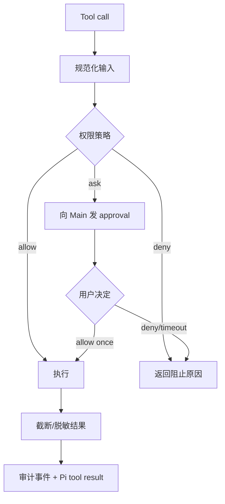
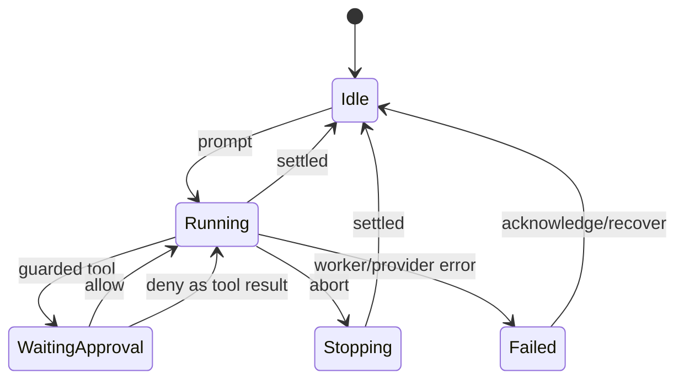
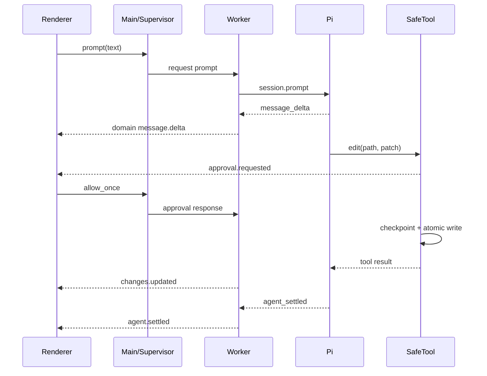

# L-Pilot 技术设计方案

## 1. 设计摘要

L-Pilot 采用 Electron + React 桌面壳，在独立 Node Worker 进程中通过 `@earendil-works/pi-coding-agent` SDK 创建会话。Pi 负责模型、Agent loop、流式事件、上下文、压缩和 JSONL 会话；L-Pilot 负责 UI、进程监督、安全工具、权限审批、workspace 边界、diff 和撤销。

技术选择可概括为：**不 fork Pi，不依赖 Tether 私有 Core，不在 Renderer 运行 Agent，不把 OS 进程隔离误称为沙箱。**

## 2. 架构目标

- 以一个端到端 vertical slice 尽快形成可用 coding agent。
- 将 Pi 版本变化限制在 `pi-driver` 包内。
- 任何文件写入必须经过统一工具策略和 checkpoint。
- UI 只理解稳定领域事件，不解析 Pi 私有对象。
- 为未来 worktree、容器和远程 supervisor 留接口，但不提前实现。

## 3. 总体架构

```mermaid
flowchart TD
    subgraph Renderer[Electron Renderer - Sandbox]
      UI[React UI]
      VM[Conversation View Model]
    end

    subgraph Main[Electron Main]
      IPC[IPC Router + Validation]
      PM[Project/Session Catalog]
      FS[Workspace Read/Preview]
      SUP[Agent Supervisor]
      SEC[Secret Store]
    end

    subgraph Worker[Node Agent Worker]
      PROTO[JSONL Protocol]
      DRIVER[Pi Driver]
      POLICY[Tool Policy + Approval Broker]
      TOOLS[Safe read/search/edit/exec]
      CP[Checkpoint Store]
    end

    PI[@earendil-works/pi-coding-agent]
    MODEL[LLM Provider]
    WS[(Workspace)]
    SESSION[(Pi JSONL Sessions)]

    UI <--> VM
    VM <--> IPC
    IPC --> PM
    IPC --> FS
    IPC <--> SUP
    IPC --> SEC
    SUP <--> PROTO
    PROTO <--> DRIVER
    DRIVER <--> PI
    DRIVER <--> POLICY
    POLICY <--> TOOLS
    TOOLS <--> WS
    CP <--> WS
    PI <--> SESSION
    PI <--> MODEL
```

## 4. 模块设计

建议 monorepo：

```text
apps/desktop/
  electron/main/       窗口、IPC、Supervisor、文件预览
  electron/preload/    window.lpilot 窄桥
  src/                 React 页面与组件
packages/contracts/    IPC、Worker 协议、领域事件 schema
packages/pi-driver/    Pi SDK 适配与原始事件归一化
packages/agent-worker/ Worker 入口、会话、ToolPolicy
packages/safe-tools/   workspace 路径、read/search/edit/exec/checkpoint
packages/session-view/ JSONL 容错解析与 UI 投影
```

### 4.1 Renderer

组件按领域拆分：`ProjectSidebar`、`ConversationTimeline`、`ToolActivityRow`、`Composer`、`InspectPanel`、`FilePreview`、`DiffView`、`ApprovalDialog`、`Settings`。使用虚拟列表渲染长会话。

Renderer 不读取文件、不持有 API key、不 spawn 进程、不直接接触 Pi SDK。

### 4.2 Preload 与 IPC

`window.lpilot` 仅暴露：

```ts
interface LPilotAPI {
  projects: { choose(): Promise<Project>; list(): Promise<Project[]> };
  sessions: { list(projectId: string): Promise<SessionSummary[]>; open(id: string): Promise<void> };
  agent: {
    prompt(input: PromptInput): Promise<void>;
    steer(text: string): Promise<void>;
    abort(): Promise<void>;
    compact(): Promise<void>;
    respondApproval(id: string, decision: "allow_once" | "deny"): Promise<void>;
    subscribe(listener: (event: DomainEvent) => void): () => void;
  };
  workspace: { list(): Promise<FileNode[]>; read(path: string): Promise<FilePreview> };
  changes: { list(): Promise<Change[]>; undoTurn(turnId: string): Promise<UndoResult> };
  models: { list(): Promise<ModelSummary[]>; select(ref: string): Promise<void> };
}
```

每个 handler 使用 TypeBox/Zod schema 校验；channel 名固定白名单；错误统一转换为不含堆栈和秘密的 `AppError`。

### 4.3 Agent Supervisor

每个活动会话最多一个 Worker。Supervisor 负责：

- spawn Node worker，并设置明确 cwd/sessionDir；
- 请求 ID、超时、stderr 环形缓冲和心跳；
- Main 退出时先 SIGTERM，再超时强杀整个进程树；
- Worker 异常后保留 transcript，允许用户显式恢复；
- 不自动重放未完成 prompt，避免重复写入。

MVP 同时只运行一个会话，减少状态与资源复杂度；侧栏可查看其他历史会话。

### 4.4 Pi Driver

Worker 内使用：

```ts
createAgentSessionRuntime(createRuntime, {
  cwd: workspacePath,
  sessionManager: SessionManager.create(workspacePath),
});
```

`createRuntime` 注入精确版本的 `ModelRuntime`、`SettingsManager`、`DefaultResourceLoader` 和 L-Pilot tools。禁用 Pi 内置 `write/edit/bash`，只注册受控工具。

Driver 将 Pi event 映射为：

```ts
type DomainEvent =
  | { type: "turn.started"; turnId: string }
  | { type: "message.delta"; messageId: string; text: string }
  | { type: "thinking.delta"; messageId: string; text: string }
  | { type: "tool.started"; call: ToolCallView }
  | { type: "tool.updated"; callId: string; patch: unknown }
  | { type: "tool.finished"; callId: string; result: ToolResultView }
  | { type: "approval.requested"; request: ApprovalRequest }
  | { type: "changes.updated"; turnId: string }
  | { type: "agent.settled"; stats: RunStats }
  | { type: "agent.failed"; error: PublicError };
```

所有事件带 `sessionId`、单调递增 `seq` 和 timestamp。Renderer 按 seq 去重；重新连接先取 snapshot，再接增量。

## 5. Worker 协议

使用 LF 分隔 JSONL，禁止通用 Unicode line separator 切分。协议只有三类记录：request、response、event。

```json
{"kind":"request","id":"r1","method":"prompt","params":{"text":"fix tests"}}
{"kind":"response","id":"r1","ok":true}
{"kind":"event","seq":42,"event":{"type":"tool.started","callId":"t3"}}
```

短命令默认 30 秒 RPC 超时，Agent turn 不使用短超时，由 abort 与心跳管理。协议版本在 handshake 中协商；不兼容时拒绝启动并提示升级。

## 6. 安全工具与权限

### 6.1 为什么替换内置写/命令工具

仅在 `tool_call` UI 上弹窗会留下绕过风险。L-Pilot 将执行边界放进工具实现：审批未返回 allow 时，工具函数本身不能写文件或 spawn 命令。

### 6.2 PathGuard

对每个输入路径执行：

1. 拒绝 NUL、设备路径和不支持的 URI。
2. `resolve(workspace, input)` 后检查词法包含关系。
3. 找到最近存在父目录并 `realpath`，再次验证真实包含关系。
4. 写入后再检查目标真实路径，防竞态符号链接替换。
5. 使用原子临时文件 + rename；临时文件必须位于目标同目录。

目录枚举忽略 `.git`、依赖、构建和用户配置目录，并设置文件数/深度上限。

### 6.3 ToolPolicy



命令分类只用于审批 UX。即便被判断为普通命令，仍受 cwd、环境变量白名单、超时、输出上限与进程树控制。Auto 模式不等于 sandbox。

环境只传 PATH、必要运行变量和 Provider 所需秘密；移除无关 token。日志对 `*_KEY`、`*_TOKEN`、Authorization 和已知 secret 值脱敏。

### 6.4 Project trust

默认不加载 workspace 内 `.pi`/package 动态扩展，只加载应用签名/内置扩展及普通 `AGENTS.md`。后续版本增加“信任此项目扩展”开关；必须与文件写入权限分开表达。

## 7. Checkpoint、Diff 与 Undo

### 7.1 数据结构

```ts
interface FileCheckpoint {
  path: string;
  existedBefore: boolean;
  beforeHash: string | null;
  afterHash: string | null;
  beforeContentRef: string | null;
}

interface TurnCheckpoint {
  turnId: string;
  files: FileCheckpoint[];
  createdAt: string;
  status: "applied" | "undone";
}
```

小文本内容压缩后保存在应用数据目录；单 turn 总量设上限（建议 20MB）。超过上限时阻止自动写入并提示用户改用 Git checkpoint，不能悄悄失去撤销能力。

### 7.2 撤销算法

1. 锁定会话变更操作。
2. 逐文件计算当前 hash，必须等于 checkpoint `afterHash`。
3. 任一冲突则整批不写，返回冲突列表。
4. 全部通过后原子恢复/删除。
5. 记录 undo entry，并刷新 diff。

这保证撤销不会覆盖 Agent 修改后用户或其他程序的变化。

Git diff 是展示增强，不是恢复事实来源；未初始化 Git 的目录也能工作。

## 8. 会话与本地数据

| 数据 | 位置/机制 | 事实来源 |
| --- | --- | --- |
| 消息/模型/compaction | Pi session JSONL | Pi |
| 最近项目/归档/置顶 | 应用 JSON 配置，原子写入 | L-Pilot |
| checkpoint 内容 | 应用数据目录，按 session/turn | L-Pilot |
| Provider 密钥 | Pi AuthStorage/系统安全存储适配 | Main/Worker |
| UI 偏好 | 应用 JSON 配置 | L-Pilot |

MVP 不引入 SQLite。会话列表按需扫描 Pi header/尾部摘要并做内存缓存；当数据量证明扫描成为瓶颈，再引入可重建索引。

## 9. 前端详细设计

### 9.1 状态分层

- Server state：project/session/model/file snapshot，通过 query cache 管理。
- Run state：当前 session、turn、approval、stream seq，由有限状态机管理。
- View state：抽屉宽度、展开行、主题，仅本地 UI store。

不要把原始 Pi messages 直接塞进全局 React store。`session-view` 从 snapshot + DomainEvent 构建不可变投影。

### 9.2 运行状态机



### 9.3 右栏数据

- Files 来自 Main 的受限目录服务，不来自 Agent 输出。
- Changes 来自 checkpoint + Git diff，按 turn 聚合。
- Run 显示当前工具、运行时长、模型和 stop。
- MVP 不显示 Tether 的 Todos、delegate 和独立 terminals 页签。

## 10. 关键时序



## 11. Tether 对比

| 维度 | Tether（调研快照） | L-Pilot MVP | 选择理由 |
| --- | --- | --- | --- |
| 前端 | Electron/React，三栏、计划、终端、视觉、Skills | Electron/React，保留三栏但只含 Files/Changes/Run | 视觉体验接近，功能面减半 |
| Agent 层 | 私有 `tether-agent-core` 包裹 Pi | 直接 Pi SDK + 自有薄 driver/safe-tools | 可审查、无私有运行时依赖 |
| 进程模型 | Main 启动 JSONL RPC Worker | 同样独立 Worker，内部用 SDK | 保留故障隔离与 SDK 灵活性 |
| 工具 | 计划、补丁、命令、delegate、诊断、搜索等 | read/search/edit/exec | 足够完成常见 vibe coding |
| 权限 | plan/ask/auto/full | Review/Ask/Auto，无 Full | 不在无强沙箱时提供危险“一键全开” |
| 沙箱 | macOS Seatbelt、实验 Windows、其他降级 | MVP 仅进程隔离与策略工具；明确非强沙箱 | 诚实约束，后续容器后端 |
| 会话索引 | JSONL + SQLite WAL | JSONL + 可重建内存缓存 | MVP 降低双存储复杂度 |
| Undo | Core checkpoint，桌面 restore 流程 | 工具层 before/after hash，整批冲突拒绝 | 恢复边界更明确 |
| Provider | UI 偏 DeepSeek/compatible，Core 更多 | 直接展示 Pi 可用模型，验证三条配置路径 | 更贴近上游能力 |
| 多 Agent/MCP | Core 已具备 | 不做 | 避免早期平台化 |
| 代码组织 | 部分超大 UI/CSS 文件 | 领域分包、组件行数约束 | 控制快速开发后的维护债务 |

## 12. 测试策略

### 单元测试

- PathGuard：`..`、绝对路径、大小写、junction/symlink、TOCTOU 场景。
- ToolPolicy：三种模式、超时、审批断线、网络/危险命令提示。
- Checkpoint：新增/修改/删除、批量原子性、hash 冲突。
- Pi event adapter：乱序防御、未知事件、delta 合并、重复 seq。

### 契约测试

使用固定 mock model 验证 Pi 版本：prompt、tool call/result、steer、abort、compact、session resume、model change 和 transcript replay。

### Electron E2E

Playwright Electron 覆盖：首次配置、选项目、执行任务、审批、看 diff、undo、重启恢复、Worker crash。真实 shell 测试必须使用临时 workspace，禁止指向仓库根目录或用户目录。

### 安全测试

- 符号链接逃逸和目录竞态；
- shell 长命令、子进程树和输出炸弹；
- Renderer 注入、恶意 Markdown/链接；
- secret 出现在错误、日志、事件和 crash dump；
- 恶意项目 `.pi` 扩展默认不加载。

## 13. 观测与故障恢复

本地结构化日志包含 sessionId、requestId、event seq、工具类型、耗时和结果码，不包含 prompt/代码/密钥。日志滚动并设置总大小上限。

Worker crash 后：

1. Supervisor 拒绝所有 pending request；
2. UI 标记当前 turn 为 interrupted；
3. transcript 与 checkpoint 保留；
4. 用户点击 Resume 后新建 Worker，从已落盘 session 恢复；
5. 不自动重放 prompt。

## 14. 后续架构扩展点

- `ExecutionBackend`：LocalProcess → Docker/Seatbelt/Windows Sandbox。
- `WorkspaceProvider`：LocalFolder → GitWorktree → RemoteMachine。
- `ToolBundle`：CoreCoding → Skills → MCP。
- `SessionSupervisor`：SingleActive → ParallelPersistent。
- `HostBridge`：Desktop file preview → VS Code diagnostics/LSP。

扩展必须保持 `PiDriver`、`ToolPolicy` 和 `DomainEvent` 三个边界稳定；否则应先写 ADR，而不是直接侵入 Agent loop。

## 15. 实施顺序

1. 建立 contracts、Pi driver 契约测试和 mock model。
2. 打通 Electron → Worker → Pi → 流式 UI 的纵切。
3. 用安全包装工具替换 write/edit/bash。
4. 加审批、checkpoint、diff、undo。
5. 加项目/会话、设置和 Tether 风格视觉。
6. 做跨平台进程树、路径与打包 E2E。

在第 3 步安全工具完成前，不应将原型发给真实项目使用。

