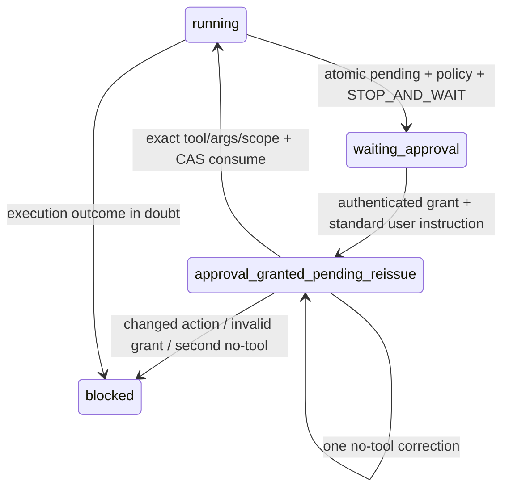

# PR-3：API 领域护栏与审批精确重入

## 改了什么

新增 ApiGuardrail 与 ApprovalProtocol。可信工具后端把调用描述为环境、租户、工作区、具体请求、OpenAPI operation、认证 scope、副作用、条件执行和外部前置条件；护栏独立于模型文本判定 allow/approval/block。未知 operation、越权 Host/端口、scope、租户、生产副作用与危险 operation 拒绝执行；POST 查询可以是只读，GET 也可以危险。

副作用要求隔离环境、明确授权及受控后端锁/条件执行合同。执行始终来自 Pi AgentTool 路径；没有批准后由宿主自动执行的第二条路径。

## 为什么

强提示不保证模型服从，也无法防止授权被改参数、换工具或重放。`beforeToolCall` 被阻断时不经过 `afterToolCall`；审批事实、PolicyStep 与 waiting 状态必须在一个轨迹事务内先写入，再返回机器可读 `APPROVAL_REQUIRED`。

## 怎么证明

- waiting 时 shouldStopAfterTurn 正常产生 agent_end；暂停不 abort，继续命令也不会额外调用 provider。
- Grant 绑定 run、tool、canonical 参数摘要、环境、workspaceRevision、preconditionDigest、来源、审批人和有效期。
- 自定义 approval_granted 消息转换为标准 user，携带 REISSUE_EXACT_TOOL_CALL、工具名、摘要与安全原参数；hash 不是参数，凭据不来自模型参数。
- 首次重入与最多一次无工具纠偏计数持久化；变参、换工具、未知工具及 Schema 失败直接 block，没有额外纠偏额度。
- pending-reissue 每个调用重新经过护栏；同批后续工具不能越过尚未完成的审批。
- stateRevision 用于 CAS；追加日志/evidenceSequence 不使授权失效，控制面/workspaceRevision 与动作依赖摘要变化使授权失效。
- 消费前精确检查，执行端在受控后端锁内再次检查前置条件。Grant 消费先保存 executionInDoubt；成功结果才清除，失败或崩溃保留并转人工，不自动重放。

`node --test dist/test/approval-contract.test.js` 验证以上 20 项固定协议/故障合同，包括伪造授权文本、重复动作需新授权与跨 run Grant；`npm run eval:harness` 三轮重跑 loop + approval 合同。全量旧门禁保留。faux 测试证明协议，真实模型重发率需要 PR-6 live 报告。

## 尚未解决

目前使用隔离测试后端验证锁与条件重检；真实 API 工具族仍须在 PR-5 提供实际隔离/If-Match/幂等条件实现。可信 operation 描述器不是模型可以自报的风险标记，未来工具必须从受控规范解析。当前不承诺任意外部系统 Exactly-once；DNS 核验到真实连接仍需沿用既有安全边界与出口约束。PR-4 Workspace/Evidence Gate、双任务族、Reviewer/live/同条件对照未通过前不能称完整 V4.5。
