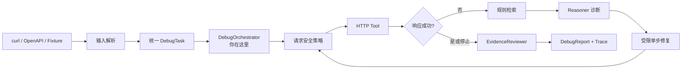
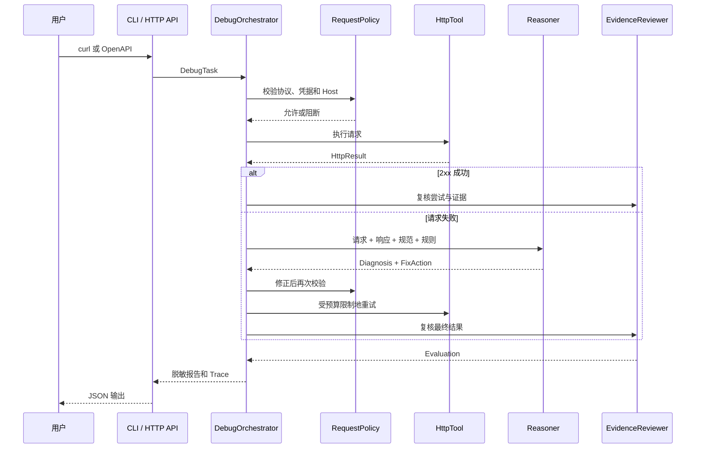

# A-Pidoc 架构与核心链路

本文只描述 `v0.4.0` 已实现的代码。规划中的文档检索、代码仓库扫描、持久化、前端界面和生产部署不在当前架构中。

## 一句话概括

A-Pidoc 接收失败的接口请求和接口规范，在受控环境中真实执行请求，依据响应和规范生成一次修复，再用下一次响应证明修复是否有效。

## 先认识术语

| 名词 | 完整名称 | 大白话解释 |
| --- | --- | --- |
| HTTP | Hypertext Transfer Protocol，超文本传输协议 | 客户端和服务端传递请求、响应的规则 |
| API | Application Programming Interface，应用程序编程接口 | 一个程序允许另一个程序调用的入口 |
| JSON | JavaScript Object Notation，JavaScript 对象表示法 | 接口常用的结构化文本格式 |
| JSON Schema | JavaScript Object Notation Schema，JSON 结构规范 | 描述 JSON 允许哪些字段和值的校验规则 |
| OpenAPI | OpenAPI Specification，开放接口规范 | 描述接口路径、方法、参数和数据结构的机器可读说明书 |
| Agent | 智能体 | 接收目标，调用能力，观察结果，再决定下一步的程序 |
| Reasoner | 推理器 | 本项目中只负责把请求、响应、规范和规则转成诊断与单步修复计划的组件 |
| Fixture | 固定测试样例 | 输入和预期结果都预先写好的可重复案例 |
| Schema | 结构约束 | 规定一个 JSON 对象允许有哪些字段、类型和值 |
| Trace | 执行轨迹 | 按顺序记录每个阶段开始、成功、失败和耗时 |
| CI/CD | Continuous Integration / Continuous Delivery，持续集成与持续交付 | 每次提交自动构建、测试，并按规则生成可追溯版本 |
| RAG | Retrieval-Augmented Generation，检索增强生成 | 先查资料，再把相关内容交给模型回答 |
| MCP | Model Context Protocol，模型上下文协议 | 用统一协议连接模型与外部工具或数据源 |

## 用户场景

> 作为刚接触接口联调的开发者，我想提交一条失败的 curl 命令或一个 OpenAPI operation，让系统告诉我失败原因、修了什么，并用真实响应证明结论。

## 核心数据流

核心对象是 `DebugTask`。无论输入来自固定案例、curl 还是 OpenAPI，进入编排器前都会变成同一种结构：请求、接口规范、输入来源和任务标识。这样增加输入类型时，不需要重写诊断循环。

## 一条请求实际经过什么

## 按可验证步骤理解核心链路

### 第 1 步：把不同输入变成统一任务

**改了什么**

- `src/input/curl-parser.ts` 解析 curl 的方法、地址、Header 和 JSON body。
- `src/input/openapi-parser.ts` 从 OpenAPI 3.x 文档选择 operation，并生成请求和基础规范。
- `src/input/debug-input.ts` 把两种输入转换为 `DebugTask`。

**为什么这样改**

核心循环只依赖统一对象，不需要知道用户粘贴的是 curl 还是上传了 OpenAPI。

**怎么证明它有效**

`test/real-input.test.ts` 和 `test/openapi-input.test.ts` 分别验证正常输入、错误输入和结构校验；`test/v1-integration.test.ts` 验证两种输入能进入 HTTP API。

**这一步还没有解决什么**

OpenAPI `$ref`、非 JSON request body、Markdown/HTML 接口文档和 Postman Collection 尚未支持。

### 第 2 步：执行前先做安全检查

**改了什么**

`RequestPolicy` 只允许 HTTP/HTTPS、拒绝 URL 内嵌凭据、限制 Host，并把最大尝试次数固定在策略中。`RealHttpTool` 另有限时、响应大小和重定向约束。

**为什么这样改**

Agent 生成的计划不能直接获得网络执行权。每一次初始请求和修正请求都必须重新经过确定性策略。

**怎么证明它有效**

`test/orchestrator.test.ts`、`test/real-input.test.ts` 和 `test/pi-reasoner.test.ts` 覆盖恶意 Host、内嵌凭据、超时、超大响应，以及“策略在 Pi 调用前阻断”。

**这一步还没有解决什么**

当前没有对 POST、PUT、PATCH、DELETE 等可能改变服务端状态的方法增加人工确认；安全依赖调用者只配置测试环境 Host。

### 第 3 步：真实执行并保留证据

**改了什么**

`HttpTool` 是统一执行接口；`FixtureHttpTool` 用固定行为回归测试，`RealHttpTool` 使用真实网络请求并返回状态码、响应体、Header 和耗时。

**为什么这样改**

诊断不能只靠语言模型猜测。第一次失败响应是根因证据，修正后的成功响应是修复证据。

**怎么证明它有效**

`examples/mock-api.mjs` 可以稳定复现 `415 → 修正 Content-Type → 200`；对应集成测试也会启动本地服务完成同一条链路。

**这一步还没有解决什么**

没有持久化历史执行、并发任务管理、真实日志平台查询和跨服务调用链追踪。

### 第 4 步：检索规则并生成单步修复

**改了什么**

`retrieveRules` 根据响应选择本地规则。`Reasoner` 接口有两个实现：`DeterministicReasoner` 使用固定分支，`PiReasoner` 使用 Pi Agent 运行时生成结构化计划。

**为什么这样改**

先用确定性实现建立可回归基线，再把不确定的模型能力放进同一接口，可以区分“工作流坏了”和“模型判断波动”。

**怎么证明它有效**

六个 Fixture 证明确定性路径；`test/pi-reasoner.test.ts` 真实实例化官方 Pi `Agent`，通过可控 provider 验证合法输出、非法 JSON、未知动作、敏感修改、模型异常、超时和显式降级。

**这一步还没有解决什么**

- required CI 不调用公网模型，因此没有线上智谱模型的稳定率、延迟和费用数据。
- `.pi/skills/api-doctor/SKILL.md` 存在于仓库，但当前 `PiReasoner` 加载的是 `src/agent/prompts/debug-agent.ts`，并未运行时加载该 Skill。
- 当前 Pi Agent 没有注册工具；网络执行和重试由外层 Orchestrator 控制，而不是模型自主调用工具。

### 第 5 步：校验模型输出再执行

**改了什么**

`PiReasoner` 对模型返回的 root cause、action、字段类型、规范值和敏感字段做运行时校验；模型不能修改 URL，也不能生成 Authorization、Cookie、Token 等敏感值。证据由本地响应、接口规范和规则重新构造。

**为什么这样改**

模型输出是“不可信建议”，不是系统命令。把可执行动作缩小到 `set_header`、`set_body`、`set_method`、`retry` 和 `stop`，才能审计和测试。

**怎么证明它有效**

Pi 测试覆盖 Markdown code fence、畸形 JSON、未知 action、规范外字段和敏感 Header；失败默认阻断，只有设置 `A_PIDOC_PI_FALLBACK=deterministic` 才降级。

**这一步还没有解决什么**

当前 Schema 校验是项目内手写的有限校验，不是完整 JSON Schema 实现；也没有基于业务语义判断“这个数值虽然类型正确但是否合理”。

### 第 6 步：Reviewer 复核并输出 Trace

**改了什么**

`EvidenceReviewer` 检查最后一次请求是否成功、固定评测中的根因是否匹配、诊断是否具备足够证据。`TraceRecorder` 记录每个阶段的顺序、状态、耗时和非敏感运行元数据。

**为什么这样改**

Reasoner 提出结论，Reviewer 决定证据是否足够；职责分离能防止“模型自己给自己判满分”。

**怎么证明它有效**

所有报告都包含 `evaluation` 和 `trace`；测试检查 Trace 顺序、Pi provider/model/Prompt 版本/timeout/fallback 元数据，以及敏感字段不进入报告。

**这一步还没有解决什么**

Reviewer 当前是确定性类，不是 Pi 子 Agent；它主要检查成功状态、预期根因和证据数量，没有对每条证据做语义一致性判断。

## 模块边界

| 模块 | 负责什么 | 不负责什么 | 关键文件 |
| --- | --- | --- | --- |
| 输入层 | 解析 curl/OpenAPI，生成统一任务 | 不执行网络请求 | `src/input/*` |
| 编排层 | 控制阶段顺序、重试预算和报告 | 不直接判断具体根因 | `src/core/orchestrator.ts` |
| 安全层 | Host、协议、凭据和脱敏 | 不进行模型推理 | `src/security/*` |
| 工具层 | 固定或真实执行 HTTP | 不决定下一步修复 | `src/tools/*` |
| 知识层 | 按响应检索基础规则 | 不是向量数据库或文档 RAG | `src/knowledge/rules.ts` |
| 推理层 | 生成诊断和单步动作 | 不能绕过策略直接执行 | `src/agent/*reasoner.ts` |
| 复核层 | 检查成功、根因和证据 | 不修改请求 | `src/agent/reviewer.ts` |
| 观测层 | 记录顺序、状态和耗时 | 不保存到外部数据库 | `src/observability/trace.ts` |
| 入口层 | 提供命令行和 HTTP API | 不复制核心诊断逻辑 | `src/cli.ts`、`src/server.ts` |

## 关键取舍

1. **确定性优先，再接 Pi**：降低首次闭环的排错难度，但 V1-A 曾因此被误称为完整 V1。
2. **Pi 在 Reasoner 后面有输出闸门**：牺牲部分自由度，换取可执行动作可控。
3. **模型只提计划，Orchestrator 掌握工具**：更安全、更容易回归，但还不是工具自主型 Agent。
4. **公网模型不进入 required CI**：避免密钥、费用和服务波动阻塞合并，但线上效果需要另建评测。
5. **显式降级**：模型失败不会悄悄伪装成 Pi 成功；是否退回确定性路径由部署者决定。

## 推荐阅读顺序

| 顺序 | 文件 | 为什么先看 |
| --- | --- | --- |
| 1 | `src/domain/types.ts` | 先认识请求、诊断、动作和报告契约 |
| 2 | `src/core/orchestrator.ts` | 看完整主循环和每个决策点 |
| 3 | `src/input/debug-input.ts` | 看外部输入怎样进入主循环 |
| 4 | `src/security/request-policy.ts` | 看模型之前的安全边界 |
| 5 | `src/agent/deterministic-reasoner.ts` | 用固定规则理解诊断职责 |
| 6 | `src/agent/pi-reasoner.ts` | 再看 Pi、脱敏、校验和降级 |
| 7 | `src/agent/reviewer.ts` | 看如何判定一次执行是否可信 |
| 8 | `test/pi-reasoner.test.ts` | 用测试反推实际承诺和边界 |

## 动手验证

先运行 `npm run demo`，观察六个固定案例；再启动 `examples/mock-api.mjs`，运行 README 中的 curl 示例，找到报告里第一次 `415`、修正动作、第二次 `200` 和最后的 `evidence_review`。

验证理解：为什么 Pi 生成了一个 `set_header` 动作后，仍然不能直接发送请求？答案应能同时提到 Orchestrator、RequestPolicy 和 HttpTool。
