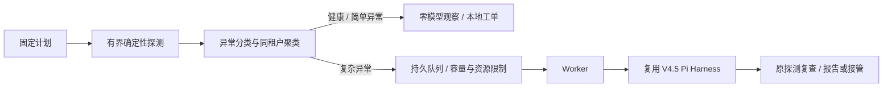

# V5 持续 API 可靠性竖切

## 改了什么

V4.5 `v0.16.0` 的模型工具控制面保留；V5增加计划、确定性探测、异常分流、持久队列和Worker，完整受控版本已发布 `v0.17.0@423142e`，见 [发布审计](v5-release-audit.md)。功能PR不是发布凭证，正式tag/Release和版本文件已核对一致。



`reliability/` 拥有任务生命周期；`harness/` 仍隔离 Pi 并治理执行，`api-harness/` 仍拥有领域权限、事实和完成条件。Worker 调用原 `ApiHarnessRuntime`，不复制工具 loop。额外 `read_monitoring_evidence` 返回当前租户事件的两份历史探测快照，明确不可刷新；API恢复后历史503仍是503，实时观察须执行注册HTTP工具。内容是观察，不给预计算根因或工具序列。GET健康调查使用附加的只读profile，POST订单验证继续使用原后端。

## 为什么

持续探测不需要每次付费调用模型。健康与明确限流/简单 HTTP 异常保持确定性报告，复杂、结构/契约漂移或未知网络事件才升级。队列将触发与调查解耦，使容量、取消、暂停和重启行为可检验。单次模型任务得到200也不能证明原监控合同恢复，Worker 必须重新检查原计划。

## 怎么证明

### 行为合同

| 能力 | 具体行为 |
| --- | --- |
| 计划与派发 | 固定间隔、禁用/启用、持久nextAt/lastSlots；网络前保存slot，同slot不重复，不补历史洪峰 |
| 实际探测 | 注册loopback GET `/health` 或明确只验证不创建订单的POST `/orders`；禁止凭据/重定向，5秒/8KiB，复用有限JSON Schema校验；最多8种合法/缺required负例 |
| 漂移与聚类 | 实际状态/Schema/延迟/注册契约header摘要，tenant/plan/类型/差异/5分钟桶聚类；有界真实引用，同cluster一次建任务 |
| 本地工单 | 持久incident记录相当于本地Bug/回归工单，含证据、次数、路由、队列与终态；不创建外部Jira/GitHub工单 |
| 路由 | deterministic/small/large/reviewer；small必须显式配置，不可用时明确选择large；预算为0或证据冲突接管，禁止静默faux降级 |
| 队列 | 默认16个未完成任务、1个并发，可配置最多128/4；全局原子claim、同资源互斥，等待审批持有资源；每run工具仍sequential |
| 预算 | 每任务20模型/40工具/80k Token/$1 SDK估算/180秒，共同Reviewer预算；持久全局估算预算默认$2并预留活跃任务预算，不是账户账单硬上限 |
| 取消/超时 | 持久取消请求、AbortSignal传入原loop、等待执行返回后才释放claim；无法取消的工具占用容量直到返回，绝不竞相重放 |
| 恢复 | 默认保留旧running任务；认证本地操作者确认旧Worker已停，再检查快照/授权执行确认，清理仅该run锁，从原上下文continue；预算不重置 |
| 补偿与接管 | in-doubt/未确认授权消费不重放，补偿只生成需新批准的隔离恢复建议；未知外部写入不自动回滚 |
| 完成 | 原硬Gate/Reviewer成功，高风险还需准确批准后的本地发布回执；随后原响应合同复查通过才将incident verified，Schema持续异常保留接管 |
| 观测 | 本地最近100样本可用性、断言通过率、错误/限流、P95、前后半窗时延；模型累计Token/SDK估算费用、队列等待和run/job终态分别列出 |

计划只由可信主机配置注册。`sideEffectFree` 是注册后端的权限事实，不能根据POST或GET方法自行判断未知企业接口是否安全。默认示例是 A-Pidoc 自己的无副作用验证服务；没有企业生产访问权。契约header变更只是检测信号，不证明第三方已经发布未通知的OpenAPI变更；完整契约分析继续使用注册仓库工具。

### 可复现命令

```bash
npm ci
npm run check
npm run demo:reliability
npm run eval:reliability
```

Demo 连续进行6个实际合法/负例探测且模型请求为0；注入临时503后由同一Harness自主调查，批准本地草稿，验证恢复；注入响应缺字段后保留manual_handoff。`eval:reliability` 连续三轮专项合同与上述场景，明确provider为faux。专项覆盖真实子进程批准发布后硬中断，认证恢复后发布账本/回执仍只有一份；也测in-doubt、取消、超时、backpressure和原Schema复查。全部旧门禁保留。

运行注册计划的本地持续模式：计划JSON按 `ProbePlan` 填写，endpoint是由可信主机启动的无副作用验证服务；状态文件建议放私有目录。

```bash
node dist/src/cli.js reliability-register --state .private/reliability/state.json --plan private-plan.json
node dist/src/cli.js reliability-watch --state .private/reliability/state.json --ticks 100 --interval-ms 1000
node dist/src/cli.js reliability-status --state .private/reliability/state.json
node dist/src/cli.js reliability-disable --state .private/reliability/state.json --plan-id orders
node dist/src/cli.js reliability-enable --state .private/reliability/state.json --plan-id orders
node dist/src/cli.js reliability-cancel --state .private/reliability/state.json --job JOB_ID
```

健康计划无需Key；复杂任务需要在启动时加载私有 `.env`（`node --env-file=.env ...`）。`A_PIDOC_PI_SMALL_MODEL` 可显式注册同provider的小模型ID；未配置时记录升级原因。发布前 `npm run eval:reliability:live` 明确使用真实DeepSeek，无fallback，原始报告/任务快照/发布账本保存在忽略目录，失败预跑保留，公开仅脱敏摘要。

审批与中断恢复分别显式操作，身份来自本地OS会话；远程服务必须另注入真实认证。

```bash
node --env-file=.env dist/src/cli.js reliability-approve --state .private/reliability/state.json --job JOB_ID --approval EXACT_APPROVAL_ID
node --env-file=.env dist/src/cli.js reliability-tick --state .private/reliability/state.json
node dist/src/cli.js reliability-recover --state .private/reliability/state.json --job JOB_ID --confirm-stopped true
```

`confirm-stopped` 必须表示操作者实际检查并停止了旧Worker，不是抢锁开关。恢复只重新排队；精确Grant由原Harness检查并让模型重发。已resolved的run不重放工具，但Worker仍要复查原合同才能标记completed。runtime endpoint必须由可信服务继续存活，不能恢复已关闭的临时Demo端口。子进程执行不明时失败关闭，不偷锁或猜测补偿。

## 尚未解决

首版本地JSON、注册fixture、有限Schema与受控profile。派发后崩溃可能产生缺测，不承诺每slot完成；历史最多4096 jobs/incidents、探测环512、状态4MiB，满后失败关闭并要求人工归档，未实现长期无界retention。状态写入进程崩溃可遗留共享写锁，默认拒绝抢锁；需先停止所有使用该状态文件的进程、备份并核验完整JSON，再由操作者清理已确认遗留的写锁。单任务恢复确认不能用于抢共享锁。没有生产DB/分布式Queue、部署、真实平台告警、长期SLO、未知企业Schema/业务修复、向量RAG、端边云、用户增益或生产Exactly-once。补偿只有待批准建议，不宣称自动分布式事务回滚；SDK成本不替代账户账单限制。

### 封版验收证据

[三轮离线摘要](evidence/v5-offline.json)记录164项总测试、20项专项合同与三次实际场景；模型provider为faux。[真实模型摘要](evidence/v5-live.json)使用DeepSeek `deepseek-v4-pro`，最终04中健康6探测/0模型；临时异常任务completed，10次模型/14次工具/34,085 Token，SDK估算$0.00933191，24,842ms，1次准确审批/1份本地回执，独立Reviewer pass。Schema事件有实际监控和API规范证据，因NO_PROGRESS_LIMIT阻断并留manual_handoff，不声称模型修复了响应字段。

01失败与02/03较早成功均保留，最终04原始报告SHA-256和规范化源码摘要冻结；单次发布前场景不是统计成功率。专项三轮出现过一次原合同复查未通过，原日志保留，增加诊断后20次定向检查和最终三轮通过；根因未复现，不编造修复结论。全部旧门禁、业务26和生产依赖audit0继续通过。
